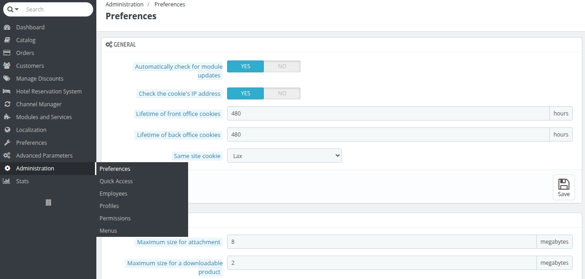

# Administration

The **Administration tab** is a critical part of the back office that allows for managing and customizing administrative settings, employee roles, permissions, and the overall organization of the back-office interface. Each section serves a specific purpose, enabling administrators to tailor the system to meet operational needs.

<!--  -->
## **Preferences**
This section manages general settings that affect system behavior and user experience in the back office.

### **Key Features**
- Automatically check for module updates.
- Enable or disable cookie IP address checks for security.
- Define cookie lifetimes for front-office (customer-facing) and back-office sessions.
- Configure file upload quotas, including attachment size, downloadable product limits, and image size caps.
- Manage notification settings for new orders, customers, and messages.

## **Quick Access**
Quick Access provides shortcuts to frequently used actions or pages, allowing administrators to streamline workflows.

### **Key Features**
- Add custom quick access links to specific back-office pages or functionalities.
- Configure link names, URLs, and whether they open in a new window.

## **Employees**
This section manages user accounts for back-office access.

### **Key Features**
- Create and manage employee profiles, including first name, last name, email, and role.
- Set account status (active or inactive).
- Configure password regeneration intervals.
- Memorize language preferences for admin panel forms.

## **Profiles**
Profiles define the roles and access levels for employees in the back office.

### **Key Features**
- Create and manage roles such as **SuperAdmin** or **Manager**.
- Assign profiles to employees to control their access.

## **Permissions**
Permissions provide granular control over what each profile can access and perform in the back office.

### **Key Features**
- Assign permissions for actions like viewing, adding, editing, and deleting in various sections.
- Configure access to hotel management, orders, catalogs, customers, and advanced parameters.
- Control permissions for specific modules or areas, such as localization, stock management, and stats.

## **Menus**
The **Menus** section organizes the back-office navigation structure.

### **Key Features**
- Create and manage menu items, including their names, associated classes, and modules.
- Enable or disable menu items.
- Define parent-child relationships to create a hierarchical structure.
- Configure the order of menus using position values.

## **Purpose of the Administration Tab**
The **Administration tab** serves as the backbone for managing the back office. It ensures:

1. **Operational Efficiency:** By providing tools like Quick Access and Menus for seamless navigation.
2. **Security and Control:** Through Profiles and Permissions, access is limited based on roles.
3. **Customization:** Preferences allow administrators to tailor the system’s behavior and notifications.
4. **Scalability:** Flexible employee and profile management ensure the system can grow with business needs.

This tab empowers administrators to secure and optimize the back-office environment for effective business operations.
You can save this content in a .md file in VS Code for easy editing and previewing. Let me know if you need further adjustments!

