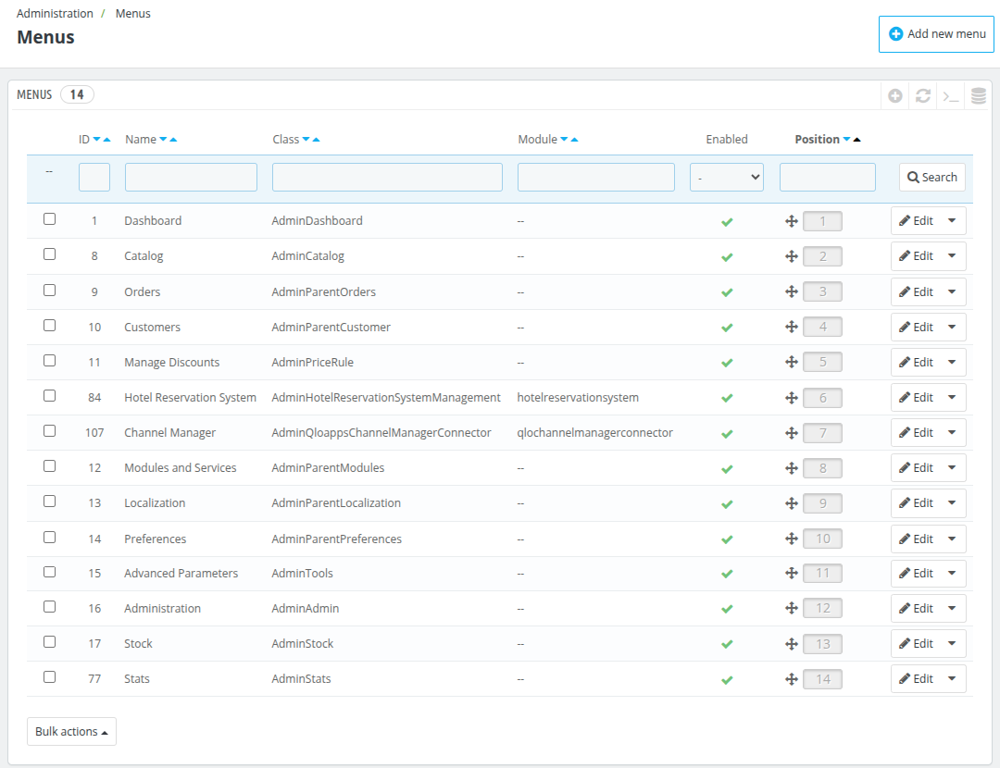
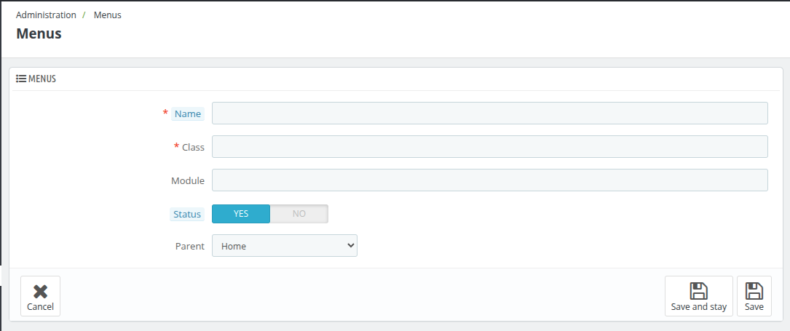

# Menus

The **Menus** section manages the structure and configuration of the menus in the back office. It allows administrators to organize, add, and configure menus that provide access to different system features.

### **Add New Menu**

Administrators can create new menus by specifying:

- **Name:** The name displayed in the back-office navigation bar. Examples include **Dashboard**, **Catalog**, and **Orders**.

- **Class:**  Refers to the controller class associated with the menu item. Defines the specific functionality or page that the menu links to.Example: Admin Dashboard, Admin Catalog.

- **Module:** Specifies the associated module (if any) for the menu.Modules extend system functionality, and menu items tied to modules may provide access to module specific features.
For example, the **Hotel Reservation System** menu is tied to the `hotelreservation system` module.

- **Status:**  Indicates whether the menu item is enabled or disabled in the navigation bar.
Yes: The menu is active and visible in the back-office navigation.
No: The menu is inactive and hidden from the navigation

- **Parent:**  Defines the hierarchical structure of menus.
Parent menus act as containers for related submenus.
Example:Parent: "Home",
Child (submenu): "Dashboard"

## Purpose
The **Menus** section is essential for:
- Organizing the back-office navigation for better usability.
- Customizing the menu structure to suit administrative needs.
- Managing module-based menus to enable or disable additional functionalities.
- Assigning menu positions for logical grouping and ease of access.

By configuring menus appropriately, administrators can ensure that the back office is intuitive and tailored to specific business workflows.