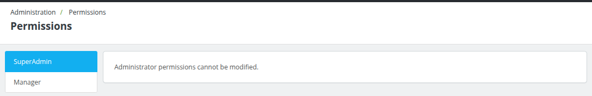
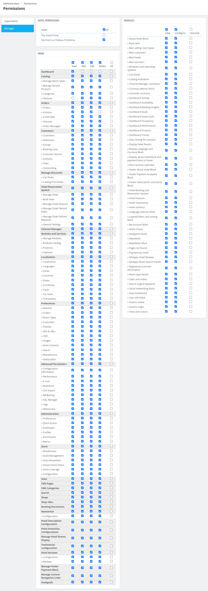

# Permissions

The **Permissions** section manages access control for different profiles (roles) within the back office, such as **SuperAdmin**, **Manager**, or other roles. It ensures employees can only perform tasks and view information relevant to their responsibilities.

### **Profiles and Permissions**
1. **SuperAdmin:**
   - Full access to all system features and sections.
   - Permissions cannot be modified for this role as it serves as the system’s top-level administrator.

2. **Manager:**
   - Restricted access compared to SuperAdmin.
   - Permissions are configurable, allowing administrators to grant or restrict access to specific sections of the back office.

### **Hotel Permissions**
Allows specific access to hotel-related functionalities such as:
  - Viewing and managing specific hotels (e.g., **Hotel Prime**, **Fairmont Le Château Frontenac**).
  - Granting permissions for actions like viewing, adding, editing, and deleting data.

### **Menu Permissions**
- Permissions are categorized by functional sections (e.g., **Dashboard**, **Catalog**, **Orders**, **Customers**, etc.).
- For each menu item, administrators can assign the following permissions:
  - **View:** Grants read-only access to the section.
  - **Add:** Allows adding new entries (e.g., products, orders, etc.).
  - **Edit:** Enables editing existing entries.
  - **Delete:** Permits deletion of entries.
  - **All:** Combines all permissions for a given menu item.

## Detailed Menu Permissions

1. **Dashboard**: Controls access to the main administrative dashboard.

2. **Catalog**: Includes management of products, room types, service products, categories, and features.

3. **Orders**: Manages orders, invoices, credit slips, statuses, and messages related to orders.

4. **Customers**: Handles customer information, addresses, groups, carts, customer service, and related details.

5. **Manage Discounts**: Manages cart rules and catalog price rules.

6. **Hotel Reservation System**: Includes permissions for hotel management, bookings, refund rules, and general settings.

7. **Channel Manager**: Allows management of modules and services for channel integration.

8. **Modules and Services**: Includes permissions for module management, catalog, positions, and payment settings.

9. **Localization**: Controls access to settings for languages, zones, countries, states, currencies, and taxes.

10. **Preferences**: Manages general preferences, room types, themes, SEO settings, CMS pages, and maintenance.

11. **Advanced Parameters**: Includes permissions for technical settings like performance, email, database backups, and logs.

12. **Administration**: Manages back-office settings, such as preferences, employees, profiles, permissions, and menus.

13. **Stock**: Includes warehouse management, stock movements, instant stock status, and configuration.

14. **Stats**: Grants access to view and analyze statistical data.

15. **CMS Pages and Categories**: Controls permissions for creating and managing content pages and categories.

16. **Shops and URLs**
: Manages multi-store configurations and shop URLs.

17. **Booking Documents**: Handles permissions for generating and managing booking-related documents.

18. **Newsletter**: Manages newsletter settings and configurations.

19. **Hotel Description and Amenities Configuration**: Permissions for configuring hotel descriptions, amenities, and room displays.

20. **Hotel Reviews and Testimonials**: Includes permissions for managing customer testimonials and reviews.

21. **Footer and Navigation Management**
: Controls custom navigation links and footer blocks, such as payment options.

22. **Dashgoals**: Grants access to goal-setting features for the dashboard.

## Purpose
The **Permissions** section allows administrators to:
- Enforce role-based access control for enhanced security.
- Customize back-office access based on job responsibilities.
- Ensure employees interact only with sections relevant to their roles, reducing errors and unauthorized actions.
- Tailor permissions for specific areas, such as hotels, orders, or customer management.

This granular permission system is essential for securely managing complex administrative environments, ensuring that employees can work efficiently while protecting sensitive information.

