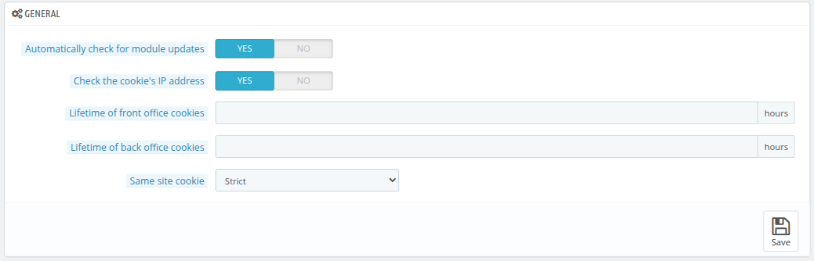

# Preferences

This section enables administrators to customize their platform's operational behavior, cookie management, file handling, and notification preferences. These configurations help optimize security, performance, and user convenience.

## General Preferences

1. **Automatically check for module updates (Yes/No):**
   Determines whether the system should automatically check for updates or new modules.
     - **Yes**: Enables automatic checks for new versions or updates.
     - **No**: Disables automatic update checks, requiring manual checks.

2. **Check the cookie's IP address (Yes/No):**
   Decides whether the system should validate the user's IP address for cookies to enhance security in order to prevent it from being stolen.
     - **Yes**: Adds an IP address check when validating cookies.
     - **No**: Skips the IP address check.

3. **Lifetime of front office cookies:**
   Specifies the duration, in hours during which the front office (customer-facing site) cookies are valid. After that amount of time the customer will have to log in again.

4. **Lifetime of back office cookies:**
   Defines the duration, in hours, for which the back office (admin panel) cookies are valid. After that amount of time the QloApps user will have to log in again.

5. **Same site cookie:**
   It allow you to declare if your cookies should be restricted to a first-party or a same-site context. It have three options:
     - **None**
     - **Lax**: Allows cookies to be sent with top-level navigation and GET requests, balancing security and functionality.
     - **Strict**

## Upload Quota

1. **Maximum size for attachment (in megabytes):**
   Sets a limit on the size of file attachments (e.g., for forms, messages, or emails) in megabytes.This value has to be lower or equal to the maximum file upload alloted by your server.

2. **Maximum size for a downloadable product (in megabytes):**
   Define the upload limit for a downloadable product(in megabytes).This value has to be lower or equal to the maximum file upload alloted by your server.

3. **Maximum size for a product's image (customizable megabytes):**
   Determines the maximum allowable size for an images to ensure they are optimized and do not excessively consume storage space.This value has to be lower or equal to the maximum file upload alloted by your server.

## Notifications

  Notifications appear as numbered bubbles in the back office, near the shop's name. They indicate the count of new items since the last interaction.
  

1. **Show notifications for new orders (Yes/No):** This will display notifications for new orders made in your shop.
     - **Yes**: Displays bubbles for each new order.
     - **No**: Disables order notifications.

2. **Show notifications for new customers (Yes/No):** Enables or disables alerts for newly registered customers.

3. **Show notifications for new messages (Yes/No):**
   This Controls whether to notify about new messages when posted in your shop, such as customer inquiries or support tickets.

