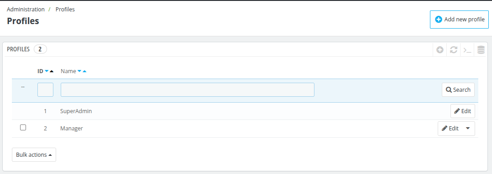
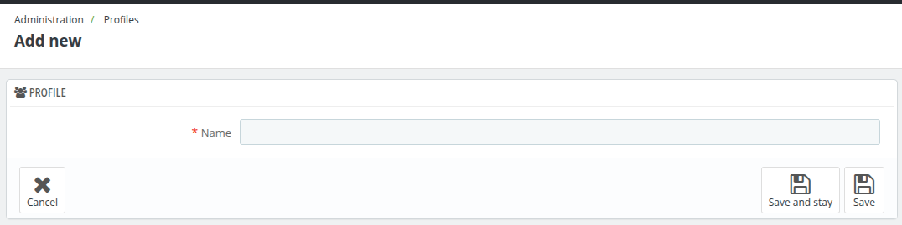

# Profiles

The **Profiles** section manages the roles or access levels assigned to employees in the system.

Profiles determine what sections and features of the back office an employee can access, helping administrators implement role-based permissions and streamline security.

### **Profiles**
Administrators can create new profiles by specifying:
1. **ID**
2. **Name** The name of the profile, indicating its purpose or level of access (e.g., SuperAdmin, Manager, etc.).

By organizing employees under clearly defined profiles, businesses can enforce better control over system access and improve operational efficiency.