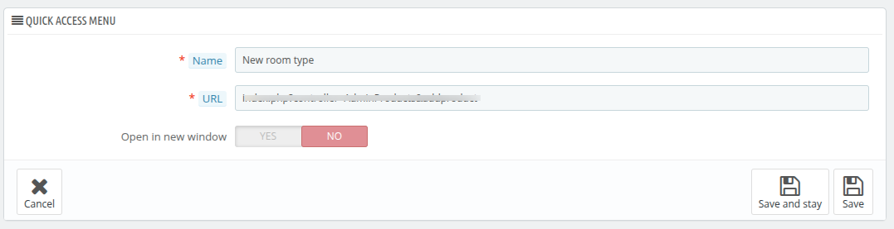

# Quick Access - Administration

The **Quick Access** menu helps administrators save time by creating shortcuts for frequently used actions or pages within the system, such as:
- Adding a new product or room type.
- Creating a new voucher or discount rule.

This feature improves workflow efficiency by providing direct access to key functionalities.This feature is particularly useful in complex administrative environments where actions are repeated frequently.

### **Add New Quick Access**
Administrators can add new shortcuts by providing the following details:
1. **ID:** A unique identifier for the quick access entry (automatically generated by the system).

2. **Name:** The name of the shortcut, which will appear in the Quick Access menu.

3. **Link:** The URL or system-specific controller link for the desired functionality or page.

4. **New window:** A toggle option to open the link in a new browser window if needed.

**You can edit these quick access as well.**