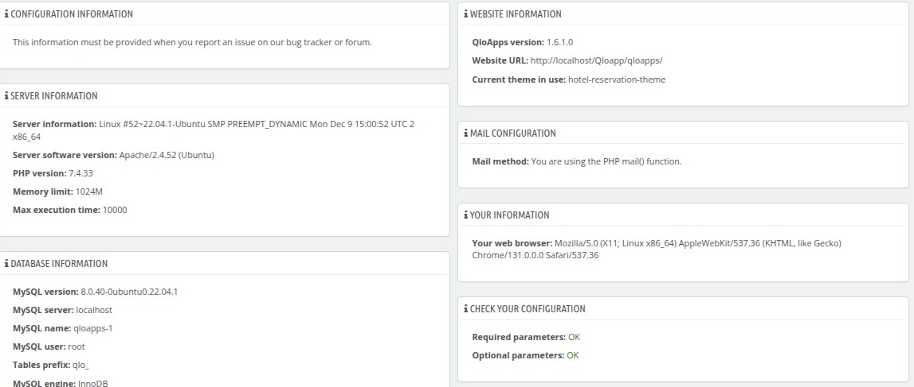
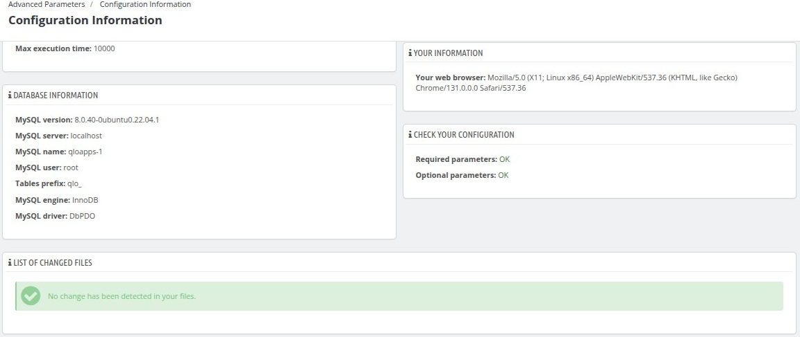

# Configuration Information

In this sub-tab, you can view all the configuration details you have set up in QloApps. This feature is highly useful for quickly reviewing all your settings. If you notice anything that needs adjustment, you can easily navigate to the specific setting to make the necessary changes.

In this page there are multiple sections which shows the different types of settings related to your QloApps.

### **Configuration Information**
- This section highlights the importance of providing configuration details when reporting issues on the bug tracker or forum.
- Helps developers or support teams diagnose and resolve issues efficiently.

---

### **Server Information**
- **Server Information**: Displays the operating system, kernel version, and architecture.
- **Server Software Version**: Shows the web server being used (e.g., Apache version).
- **PHP Version**: Indicates the PHP version installed on the server.
- **Memory Limit**: Specifies the maximum memory allocated for scripts.
- **Max Execution Time**: States the maximum time a script is allowed to run before timing out.

---

### **Database Information**
- **MySQL Version**: Shows the version of MySQL being used.
- **MySQL Server**: Indicates the database server's hostname (e.g., localhost).
- **MySQL Name**: Displays the name of the database in use.
- **MySQL User**: Specifies the username for accessing the database.
- **Tables Prefix**: Shows the prefix added to database table names.
- **MySQL Engine**: Indicates the storage engine used for the database (e.g., InnoDB).

---

### **Website Information**
- **QloApps Version**: Specifies the version of QloApps installed.
- **Website URL**: Displays the URL where the QloApps instance is hosted.
- **Current Theme in Use**: Indicates the active theme used for the website.

---

### **Mail Configuration**
- **Mail Method**: Explains the method being used for sending emails (e.g., PHP `mail()` function).

---

### **Your Information**
- **Your Web Browser**: Provides details about the user's browser, including its version and platform.

---

### **Check Your Configuration**
- **Required Parameters**: Confirms whether all mandatory settings are correctly configured.
- **Optional Parameters**: Indicates the status of optional configurations.
