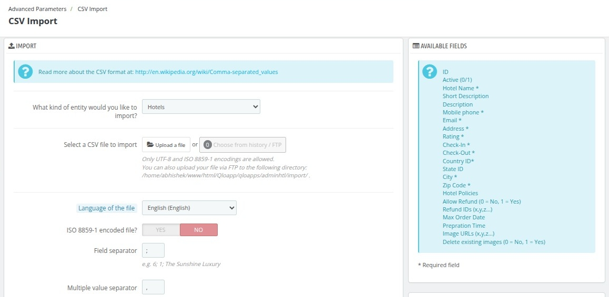
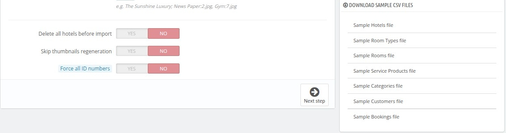

# CSV  import

The CSV Import page allows you to upload data in bulk by importing CSV files. This feature is especially useful for managing large datasets such as hotels, bookings, or customer records. By configuring the import settings, you can ensure smooth and accurate data integration into your QloApps system.

### Import Configuration
- **Entity Selection**:
  - Choose the type of data you want to import (e.g., Hotels, Rooms, Bookings) from the dropdown menu.

- **File Upload**:
  - **Upload a file**: Click the button to upload a CSV file directly from your computer.
  - **Choose from history/FTP**: Select a file previously uploaded via FTP.

- **Supported File Encodings**:
  - Only UTF-8 and ISO 8859-1 encodings are allowed for CSV files.

- **Language of the File**:
  - Select the language of the data in your file to ensure proper interpretation.

- **ISO 8859-1 Encoded File**:
  - Enable this option if your file uses ISO 8859-1 encoding.

- **Field Separator**:
  - Define the character used to separate fields in the CSV file (e.g., `;`).

- **Multiple Value Separator**:
  - Specify the character used to separate multiple values within a single field (e.g., `,`).

---

### Additional Options
- **Delete All Hotels Before Import**:
  - **Yes**: Removes all existing hotels in the database before importing the new data.
  - **No**: Keeps existing hotels and adds the imported data.

- **Skip Thumbnails Regeneration**:
  - **Yes**: Speeds up the import process by skipping thumbnail regeneration.
  - **No**: Ensures new thumbnails are created during the import process.

- **Force All ID Numbers**:
  - **Yes**: Forces the import to use the ID numbers specified in the CSV file.
  - **No**: Allows the system to generate unique ID numbers automatically.

---

### Available Fields
On the right-hand side, you will find a list of fields available for import:
- **ID**: Unique identifier (optional).
- **Active**: Whether the record is active (0 = No, 1 = Yes).
- **Hotel Name** (Required): The name of the hotel.
- **Short Description**: A brief description of the hotel.
- **Description**: Detailed information about the hotel.
- **Mobile Phone** (Required): Contact number for the hotel.
- **Email** (Required): Email address associated with the hotel.
- **Address**: Physical address of the hotel.
- **Rating**: Hotel’s rating.
- **Check-In** (Required): Check-in time for the hotel.
- **Check-Out** (Required): Check-out time for the hotel.
- **Country ID**: Identifier for the country.
- **State ID**: Identifier for the state.
- **City**: City where the hotel is located.
- **Zip Code**: Postal code of the hotel.
- **Hotel Policies**: Policies applicable to the hotel.
- **Allow Refund**: Indicates if refunds are allowed (0 = No, 1 = Yes).
- **Refund IDs**: Specific refund policies.
- **Max Order Date**: The latest date a booking can be made.
- **Preparation Time**: Time required to prepare bookings.
- **Image URLs**: Links to images of the hotel (x,y,z format).
- **Delete Existing Images**: Specify whether to delete existing images (0 = No, 1 = Yes).

*Fields marked with an asterisk (*) are required.*

---

### **Best Practices**
- Ensure your CSV file matches the format specified in the **Available Fields** section to avoid import errors.
- Use the **Delete All Hotels Before Import** option with caution to avoid accidental data loss.
- Test with a small dataset before importing a large file to verify the settings.
