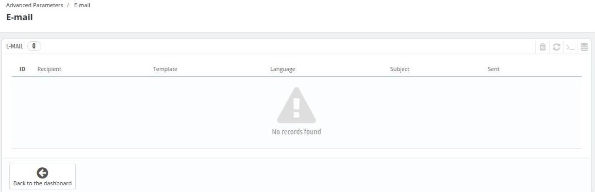
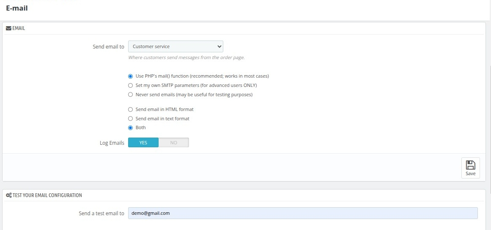

# Email

The E-mail Settings page allows you to configure how your QloApps system handles emails, ensuring smooth communication between your website and its users. This section provides options for seeing received emails,  selecting email recipients, choosing an email delivery method, and testing your email configuration.

### E-mail Configuration
- **Send Email To**: 
  - Select the recipient for customer messages from the drop-down menu. Typically, this will be directed to the **Customer Service** team.
  
- **Email Delivery Method**:
  - **Use PHP's `mail()` function**: Recommended for most users as it works in standard hosting environments.
  - **Set my own SMTP parameters**: For advanced users, allows configuration of custom SMTP settings for email delivery.
  - **Never send emails**: Useful for testing purposes or if email functionality is not required.
  
- **Email Format**:
  - **Send email in HTML format**: Emails will be formatted in rich HTML for better presentation.
  - **Send email in text format**: Emails will be plain text, useful for basic email clients.
  - **Both**: Sends emails in both formats (HTML and text) to ensure compatibility with all email clients.
  
- **Log Emails**:
  - **Yes**: Enables logging of all emails sent from the system for tracking and troubleshooting.
  - **No**: Disables email logging to save server resources.

---

### Test Your Email Configuration
- **Send a Test Email To**:
  - Enter an email address to receive a test email and ensure that the configured email settings are working correctly.
  - Click **Save** after making changes to apply the settings and use the test email feature.

---

### Best Practices
- Use the **PHP mail() function** if you’re unsure about SMTP parameters or don’t have specific email server requirements.
- Enable **Log Emails** during testing or debugging to identify potential issues with email delivery.
- Always send a test email to verify the configuration before using the email settings in a live environment.
