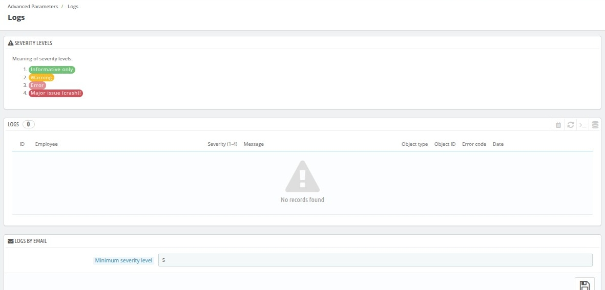

# Logs

The Logs sub-tab provides a centralized view of system events and errors. It helps you monitor the application's health and identify potential issues.

## Severity Levels

* **Informative only:** These are informational messages that do not indicate any errors or issues.
* **Warning:** These messages indicate potential problems or deviations from expected behavior.
* **Error:** These messages indicate errors that have occurred, but the system may still be functional.
* **Major issue (crash):** These messages indicate critical errors that have caused the system to crash or malfunction.

**Logs**

* This section displays a list of recent log entries.
* **Columns:**
    * **ID:** A unique identifier for each log entry.
    * **Employee:** The user who performed the action or triggered the event.
    * **Severity (1-4):** The severity level of the log entry (1-4, with 4 being the most critical).
    * **Message:** A detailed description of the event or error.
    * **Object type:** The type of object involved in the event (e.g., order, customer, product).
    * **Object ID:** The ID of the specific object involved in the event.
    * **Error code:** A unique code associated with the error (if applicable).
    * **Date:** The date and time the event occurred.

## Logs by Email

* **Minimum severity level:** You can configure the minimum severity level for email notifications. Only log entries with a severity level equal to or greater than the specified level will be sent via email.
