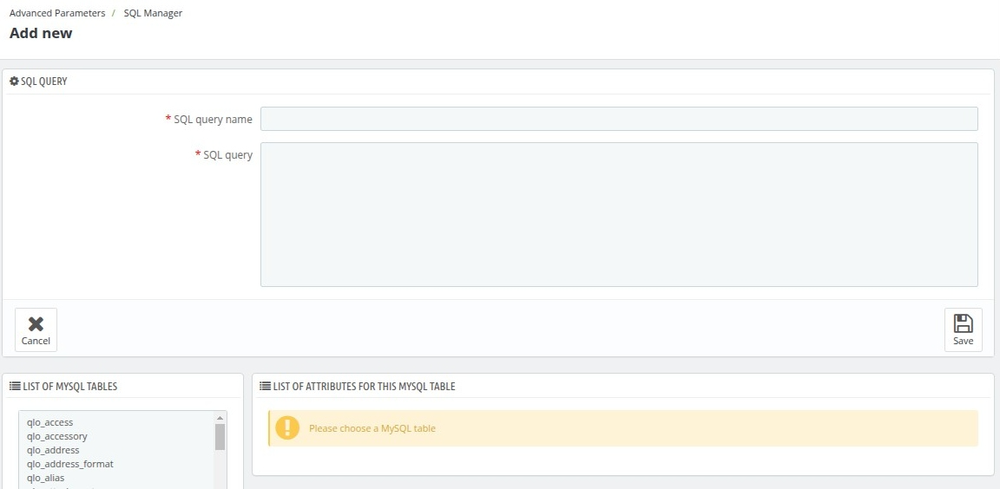

# SQL Manager

The SQL Manager allows you to create and manage custom SQL queries to interact with your database. This can be useful for tasks like data extraction, analysis, and troubleshooting.

## Creating a New SQL Query

   * Click the **"Add new SQL query"** button.

- **SQL query Name:** A descriptive name for the query.
-   **SQL query:** Enter your SQL query in the provided field.
- **Note:** Only SELECT statements are allowed when saving the query.

- Click **"Save"**.

**3. Viewing Query Results**

   * After saving a query, you can view the results by clicking the **"Edit"** action in the dropdown menu next to the query name.
   * You can also export the query results as a CSV file by clicking the **"Export"** button in the same dropdown menu.

## Query Management

   * This table will show all your saved SQL queries.
   * You can use the table to view, edit, or delete existing queries.

## Settings

   * **Select your default file encoding:** Choose the default encoding for exported CSV files.

**Note:**

* The SQL Manager allows you to execute custom SQL queries directly against your database.
* Use caution when executing SQL queries, as incorrect queries can potentially damage your database.
* It is recommended to test your queries thoroughly in a development environment before executing them on a production server.

