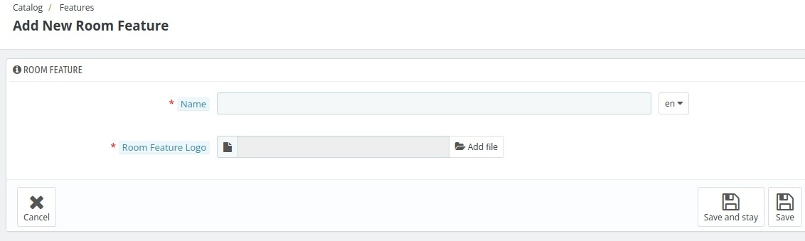

# Features
In features tab we define features of the rooms like wifi, power backup etc. You can change the position of already existing features.

To change the position of features just drag to there desired position.

*To add new room feature click on the **Add new Room Feature** button.*

## Add new room Feature

1. **Name** : In this field you have to enter the name of the feature.
2. **Room feature logo** : In this field you need to select the logo image of the feature.

