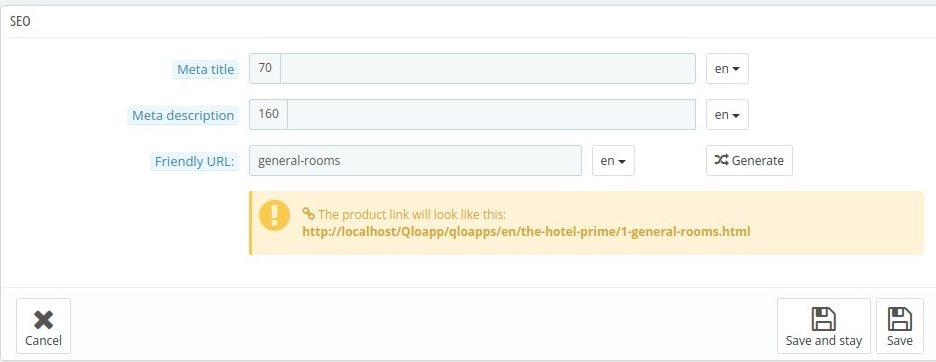
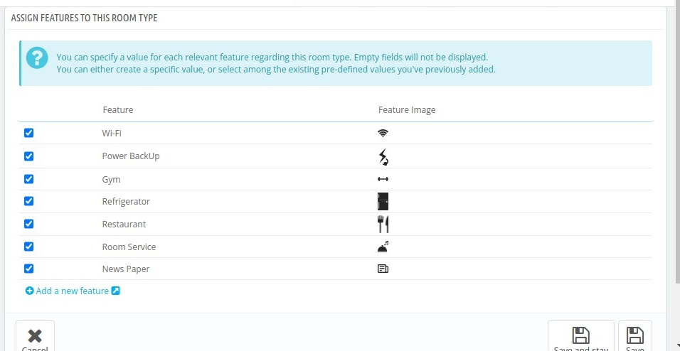
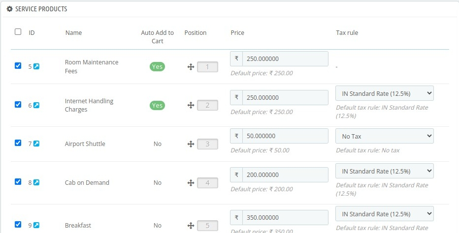
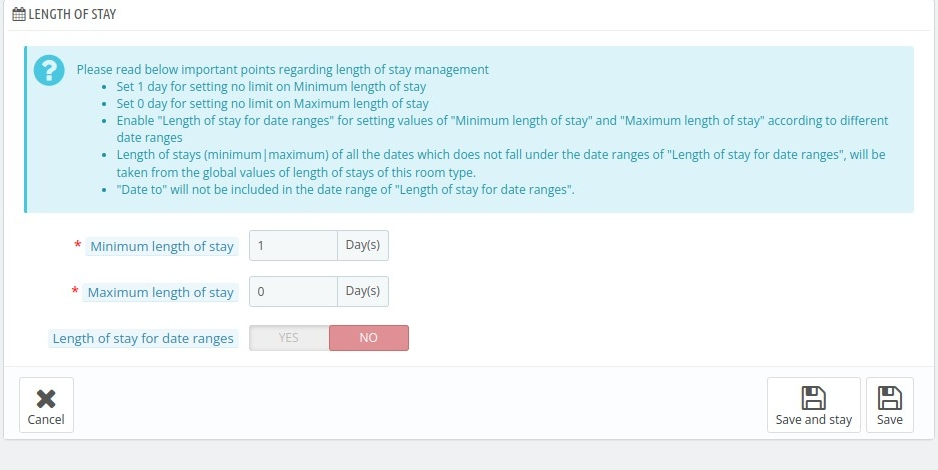

# Manage Room Types

On this page, you can manage room types by editing existing ones or creating new ones.

Before creating a new room type, ensure that a hotel is already set up, as the new room type which will added need to be assigned to a specific hotel.

*To Add new Hotel* : [Link to Hotel add]

As shown in the image we have some Key performance indicators which tell the insights of a day like:

 

- **Total Rooms** : It tells you about the total number of rooms combing the all room types.

- **Occupied Rooms** : It tells you about the total rooms have occupied on that day.

- **Vacant Rooms** : It tells you the total number of rooms are vacant today.

- **Booked Rooms** : It tells you the total number of rooms are booked today.

- **Disable Rooms** : It tells you the rooms that currently are disabled.

- **Online Bookable Rooms** : It tells you the rooms that are available for online booking.

- **Offline Bookable Rooms** : It tells you the rooms that are available for offline booking.

- **Best Selling Rooms** : It tells you the best selling rooms based on the sales of last 30 days.

- **Disabled Rooms Types** : It tells you the total number of rooms types that are currently disabled.

There are three different buttons on the left:

1. It is used to refresh the values of the KPIs.
2. It is used to determine which KPIs should be displayed and which ones should be hidden.
3. It is used to change the view type.

## Filters

 #### Available Fields
You can apply this filter to see different type of available fields as shown below select the fields which you want to
see.

 

#### Filter
There is an another filter button on the right which includes fields like below image:

In this filter you can filter list based on:
- **ID** : ID of the room type.
- **Number** : Number of adults allowed for that specific room type.
- **Base price** : You can enter the range of the base price for the rooms.
- **Show at front** : You can select Yes/NO if the room type you want to filter is allowed on the front office or not.
- **Features** : You can filter based on the features of the room types.
- **Location** : You can filter based on the location of the hotel.- **Name** : You can filter the list based on the name of the room type.
- **Children** : You can select the number of the children range.
- **Status** : You can filter list based on the status of the room type.
- **Advance payment** : You can filter results based on the Advance Payment amount.
- **Service Products** : You can filter based on the Service Products.
- Similarly you can filter Results based on following fields:
Hotel, Total rooms number, maximum occupancy, Tax rules and additional facilities.

*To create a new room category click on **Add new Room types** button*

## Add new Room type :

In the Add new room type page you have to enter some details in each section which are as follows :

### Information

1. **Room type** : In this field you will write the name of the room type.
2. **Select Hotel** : In this field you will select the Hotel in which you want to assign this room type to. Please be noted that once the hotel once assigned can not be changed after saving the details.
3. **Enabled** : In this field you have to select if you want to Enable this room type or not.
4. **Show at front office** : In this field you have to select if you want to show it at the front office or not.
5. **Short description** : In this field you have to enter a short description for the hotel category.
6. **Description** : In this field you can enter a description for you room type.

### Price

#### Room Type price section

**In this section you can enter or edit details related to pricing of
the room type.**

1. In **Pre-tax operating cost** you have to enter your operating cost of the room type.
2. In **Pre-tax retail price** you have to enter the price in which you want to sell the room exclusive of tax.
3. In **Tax-rule** you have to select the tax rule you want to apply in the room type.
4. The system will automatically fill the value of **Retail price with tax** based on the Pre-tax retail price and Tax rule which you have entered.
5. In **Allow advance payment** field you can select weather you want to allow customers to pay in advance or not.
6. In **Apply Room Type Advance Payment Setting** field you can choose weather you want to use global advance payment or you want to make a specific rule for this type of room type.
If you select Yes means you want to make a new Advance payment rule for this type of room and if you select No in this field means you want to choose global advance rule.
   1. If you select Yes in the above field you will see some more fields.
   2. In **Payment type** field you can select which payment method you will allow the customer to pay in you can choose between percentage (percentage of room price) and amount.
   3. In the **Value** field you have to enter the amount of percentage or amount depends on what you have selected in the above field.
   4. In **Include tax** field you have to select if you want to include tax in the advance payment or not.

#### Advance Price rule section
In this section you will see all advance price rule you have set for this room type.
To make new advance price rule you can refer to this document: [Link of document containing add new advance price rule].

#### Specific Price Rule section
In this section you can Add new specific price rule or can edit already existing specific price rule.

**Specific Price Rule** : These rules are the special discounts which you can apply for specific people based on their
country, Group or currency they are making payment in.
To add new specific price rule click on add new specific price rule button.
When you click on to add new specific price rule you will see below interface:

1. In for field you can select for which this rule will be applicable to
   1. First you can select the currency type for which this rule will be applicable to.
   2. Second you can select for which country this rule will be applicable to.
   3. Third you can select for which group this rule will be applicable to.

2. In **Customer** field you can select any customer for which this rule is specific to.
3. In **Available** field you can select the date range in which this rule is applicable to.
4. In **Room type price** field you have to enter the base price on which you will apply discount.
5. In **Apply a Discount** of field you have to enter discount value which you want to apply.
6. Last step is to save the changes you have applied.

#### Priority Management Section
In this section you will set the Priority for the specific price rule.
Let's consider you have made multiple Specific Price Rules and a customer is eligible for more than one rule to set
which rule will be applied you have to set the Priority of the rules.

Select the field to apply priority, with higher priority assigned to the fields on the left and decreasing as you move to the right.

Select **Apply to all products** to apply this rule to every room type.

**Note:** The more specific a rule is, the higher priority it will hold. For example : Group is more specific than the country.

### SEO Section
In this section you enter details which is important for the SEO, so that customer can search room type without searching the name of the website.

1. In **meta title** field you have to enter the Meta title for this room type page.
2. In **Meta description** field you have to enter a meta description for your room type.
3. In **Friendly URL** section you have to enter a Friendly URL or you can go with the automatic selected.

### Images Section
In this section you have to upload some images for this room type. 

1.  In **Add a new image to this room type** field you can upload your desired image.
2.  In **Caption** field you can write the caption for the image.
3.  You can also drag the already existing image to change their orders.

### Features Section
In this section you can select and un select features for the room types by clicking on the checkbox button
and you can also add make new features by clicking on the **Add new Feature** link.

**To add new features you can visit this page** : [link to catalog  add new features]

### Rooms Section

Add individual rooms to your room type to manage your property's inventory. For each room number you create, you'll need to specify the following parameters:
1. **Room number** : In this field you can enter the room numbers which represent each room.
2. **Floor** : In this field you can enter floor of that room number you are mentioning.
3. **Status** : In this field you can select the status of room like Active, Inactive and Temporarily Inactive.  
Active: When the room is in active state and available for booking.
  Inactive: When a room is permanently unavailable for booking, often due to being repurposed for other uses.
 
Temporarily Inactive: When you want to temporarily inactive the room from booking often due to maintenance. You can select disable dates for the duration for inactive status.

 

Drag to select dates and also you can unselect selected dates from the Remove dates button.

1. **Extra Information** : In this field you can enter extra comments in this field.
2. **Disable Dates** : In this field you can enter dates for which you want to set this room type as Inactive.

After entering all rooms click on save and stay to save the Information.

### Occupancy Section

1. **Base Adults** : In this field you need to enter the minimum number of adults allowed in the room.
2. **Base children** : In this field you need to enter the minimum number of children allowed in the room.
3. **Maximum adults** : In this field you need to enter the maximum number of the adults allowed in the room.
4. **Maximum Children** : In this field you need to enter the maximum number of the children allowed in the room.
5. **Maximum room Occupancy** : In this field you need to enter the maximum number of the person allowed in the room.

### Service Products Section
In this you can edit already defined Service products for example change the position, Price and tax rule.

### Length of Stay section
Length of stay is defined as the duration of the stay in the number of days for the room type.

1. **Minimum length of stay** : In this field you can set value for which minimum number of days for which the customer can book the room.
2. **Maximum length of stay** : In this field you can set value for which maximum number of days for which the customer can book the room.
3. **Length of stay for date ranges** : In this field you can select if you want to apply the date range.
4. If you have selected yes in the Length of stay for the date ranges you need to fill following
fields:
 
 

   1. **Date From** : In this field you need to enter the starting date of the date range.
   2. **Date To** : In this field you need to enter the ending date of the date range.
   3. **Minimum Length of Stay** : In this field you need to enter minimum number of the length stay.
   4. **Maximum Length of Stay** : In this field you need to enter maximum number of the length stay.

### Additional Facilities section
Select all the facilities which you want to provide your guest with this room type. The facilities provided with the room can be avail on the per day price basis or for the entire booking.

You can change the price from here.

**After filling all the above details your room type will be created.**