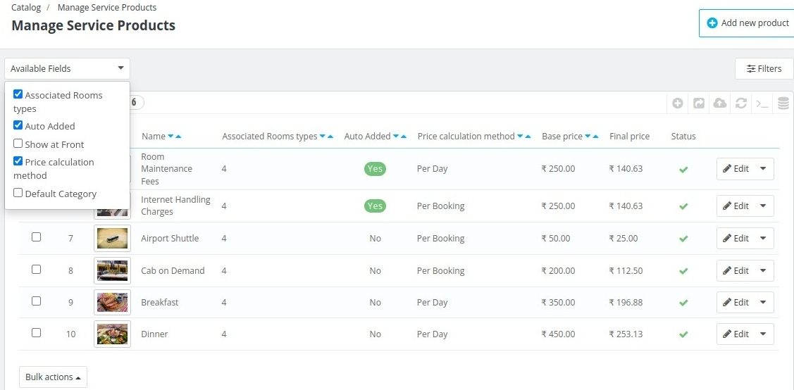
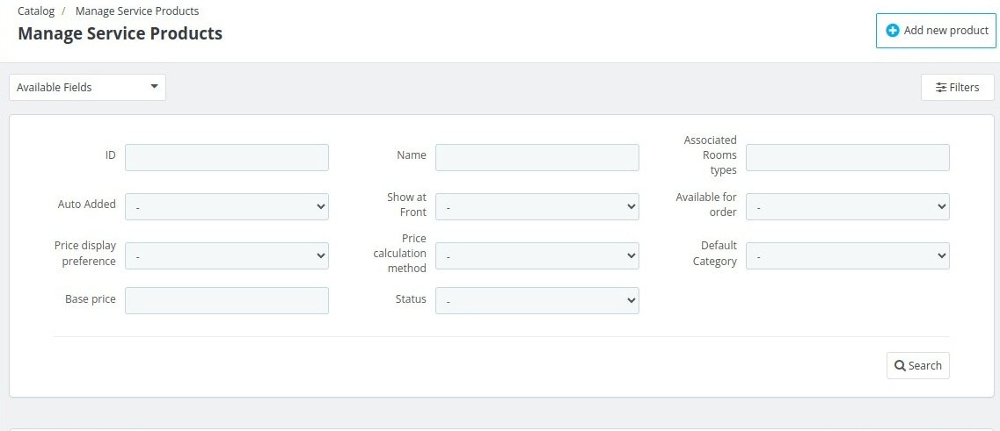
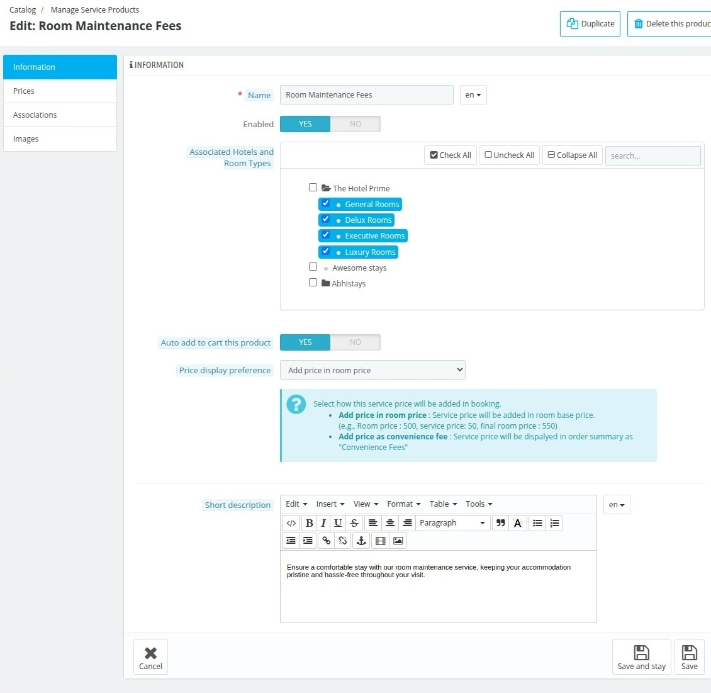
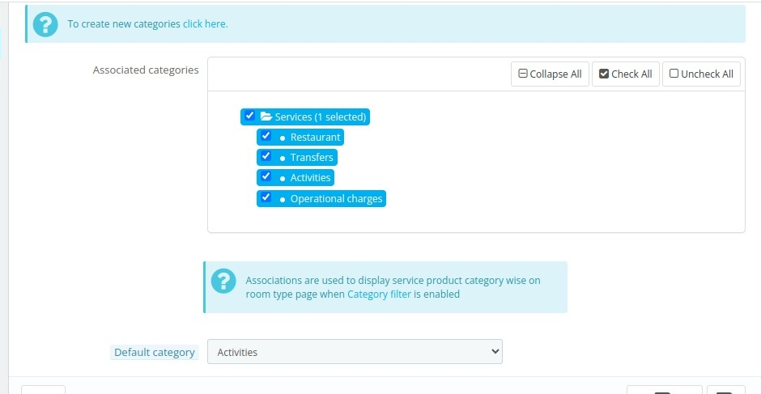

# Manage Service Products
Here, you can add the services you offer to customers, such as transportation, dining options, and more.
  

 

In this tab you can manage following tasks:
1. Add new service products for your hotel.
2. You can Edit already existing service products.
3. You can duplicate already existing service products.

## Filters

There is filter to which you can apply to see only the desired list you want.

Another filter you can apply is by clicking on the right filter button. In that filter there are many fields you can enter.

In this filter you can filter list based on ID , Whether that service product is Auto Added or not, Price display preference, based price, which is allowed to show at front office, based on the name of the service product,
 Price calculation method, status of the service product, Associated room type, Available for order, Default category.

 *To create a new room category click on **Add new Product** button*

 ## Add new Product
 In add new product you have to fill information in the following sections:
 ### Information Section
 

 1. **Name** : In this field you need to enter the name of the service product.
 2. **Enabled** : In this field you need to select weather you want to enable this service product.
 3. **Associated Hotels** : In this field you need to select hotels this service product will be associated to.
 4. **Auto Add to cart** : In auto add to cart product is not visible to the customer and the price is added to the final total. Select Yes or No to add product to the cart.
 5. **Price display preference** : In this field you need to select weather you want to *Add price in the room price* or *Add as a convenience fee*.
 6. At last enter some description and save it.

### Price Section

1. In **Pre-tax rack rate** you need to enter your base price of the service product exclusive of taxes.
2. iN **Pre-tax retail price** you need to enter the selling price of the product.
3. In **Price calculation method** you need to select if you want to add price per day or once at the booking.

### Associations Section
Associations are used to display service product category wise on room type page.

1. **Associated categories** : In this field you need to select the category of the service products.
2. **Default Category** : In this field you need to select the default category of the product.

### Images Section

1. **Add a new image to this product** : In this filed you can upload your desired image for this service product.
2. **Caption** : In this field you need to enter the caption you like to add.
3. In the below field you can mange the position of the images and can also delete them.