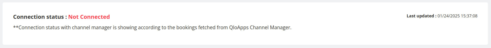

# Channel Manager

The **Channel Manager** tab integrates with QloApps to help hoteliers efficiently manage property details, and bookings across multiple Online Travel Agencies (OTAs) and online distribution channels.

It ensures real-time synchronization, eliminating manual effort and reducing errors.

## **What is a Channel Manager?**
A **channel manager** is centralized software that:
- Synchronizes property availability, rates, and restrictions across multiple OTAs and distribution channels.
- Automates the synchronization of bookings between connected OTAs and the QloApps PMS.

With QloApps Channel Manager, properties can easily connect with OTAs.

## **Connection Status**
Displays the current connection status with the channel manager.
  - **Status:** Indicates whether the property is connected or not.
  - **Last Updated:** Shows the last synchronization timestamp.
  Example: *"Connection status: Not Connected."*

- The connection status reflects whether bookings are successfully fetched from the **QloApps Channel Manager**.

   

## **How to Connect with Channel Manager?**
Follow these simple steps to establish a connection:

1. **Enable QloApps Webservice:**
   - Navigate to the **Webservice tab** and enable the QloApps webservice.
   - Create a webservice key and enable all required APIs.

2. **Create an Account on the Channel Manager:**
   - Register with the channel manager platform.

3. **Enter Webservice Credentials in Channel Manager:**
   - Input the QloApps webservice credentials under the **PMS settings** in the channel manager.

4. **Synchronize and Map Data:**
   - Synchronize and map hotels and room types in the channel manager to ensure accurate data exchange.

For a detailed guide, visit the **[Connection with PMS](https://qloapps.com/qloapps-channel-manager/#section-38)** documentation.

**Once you are connected with QloApps Channel Manager then you can easily manage your properties connected with OTA's like Booking.com, Expedia, Airbnb, Agoda, Google Hotels, and more.**

## **Resources**
- **Connection Process:** For detailed steps, visit the [Connection with PMS](https://qloapps.com/qloapps-channel-manager/#section-38) guide.
- **Channel Manager Features:** Explore detailed documentation on how the channel manager works and its full capabilities.
