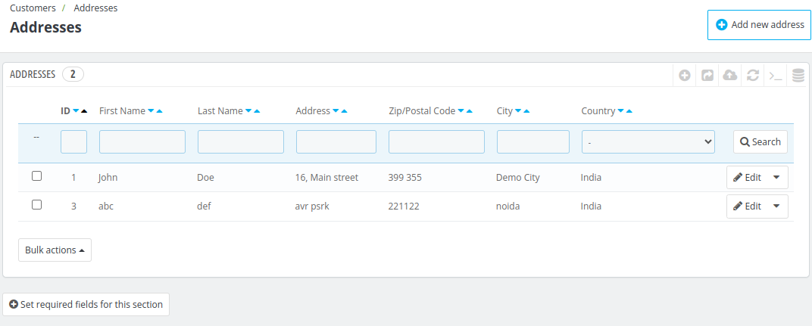
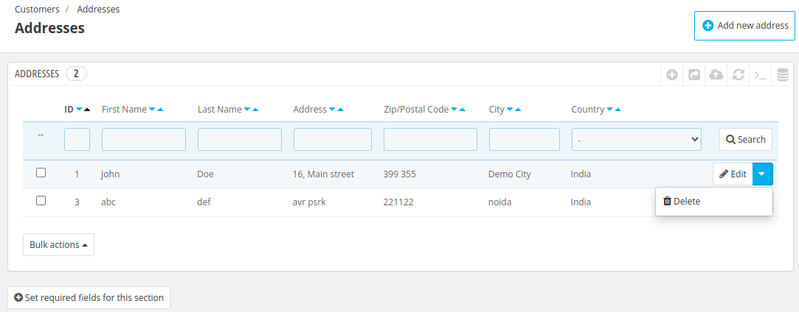

# Addresses

This column displays the customer's addresses associated with their booking.

It includes essential details such as name, address line, city, country, and postal code, providing a comprehensive view of the guest's contact and location information.

## Add New Address

To add a new address for the customer click on add a new address.

Here, the admin needs to enter the following fields:

- **Identification Number:** This is the ID card number of the customer of his company
- **Address Alias:**  a false name or a different name that a guest uses when checking into a hotel.
- **First Name:** First name of the customer.
- **Last Name:** Last name of the customer.
- **Company:** Company name of the Customer
- **VAT Number:** VAT identification number
- **Address:** Customer's Address
- **Zip Code:** Customer's Zip Code
- **City:** customer's city
- **Country:** Customer's residing country
- **State:** Customer's residing state
- **Home Phone:** Customer's home phone number
- **Mobile Phone:** Customer's mobile phone number
- **Other:** If any other information is required

Then, click on Save.

## Delete an Address
Click on the delete button to delete the address of your desired customer.

## Edit an Address

Click on the edit button to edit the address of your desired customer.

Follow the same steps of adding a new customer's address to edit the existing addresses.

## Set required fields for this section

From this section, Admin can make any field mandatory, by clicking on **Set required fields for this section**

