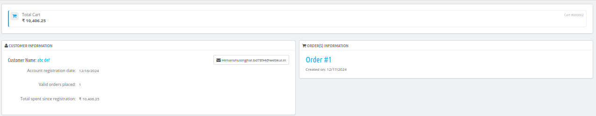
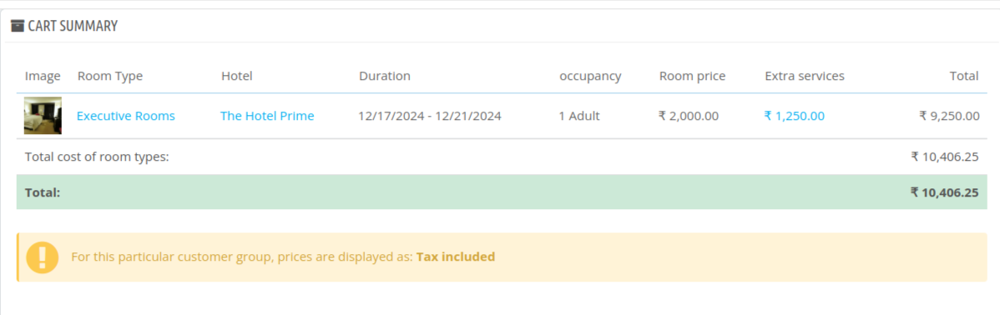

# Booking Carts

On this page, the admin can monitor Visitors' booking carts in real time, along with the displayed KPI metrics.

## KPI Metrics

- **Conversion rate:** percentage of customers who successfully created a booking in the last 30 days.
- **Abandoned Cart:** No. of customer who added a room to their cart but didn't complete the purchase in the last 24 hours.
- **Average Order Value:** It shows the average amount of money a customer spends per order over a specific time period.

- **Net profit per visitor:** The average amount of money the hotel makes from each customer visit over a specific time period.

**Note:** You can click on the **Export Carts** option to export the details of the cart as a CSV file.

## View a cart

Under Order ID, you will see the status of the cart such as:

- **Ordered Cart:** When the customer has successfully placed an order.
- **Non-Ordered Cart:** When the customer has added items to their cart but has not yet placed an order.
- **Abandoned Cart:** When the customer adds items to their cart but does not place an order within 24 hours, the cart is marked as abandoned.

Click on "View" to see more details of the cart.

After clicking on "View," you will see the customer's information and details about his carts.

### Customer Information

Here, details of the customer will be displayed such as:

- **Customer name:** Name of the customer.
- **Account registration date:** When was the customer's account created.
- **Valid orders placed:** Total no of orders placed successfully.
- **Total spent since registration:** Total amount spent by the customer till date.

Admin can click on the customer email option to send them the email.

### Order Information

Here, the associated order number for this cart will be displayed.

### Cart Summary

A summary of the cart will be displayed here along with the details:

- Room image
- Room type
- Hotel
- Duration
- Occupancy
- Room Price
- Extra Services
- Total Amount

You can click on **Extra Services** to view all the additional services utilized by the customer.

