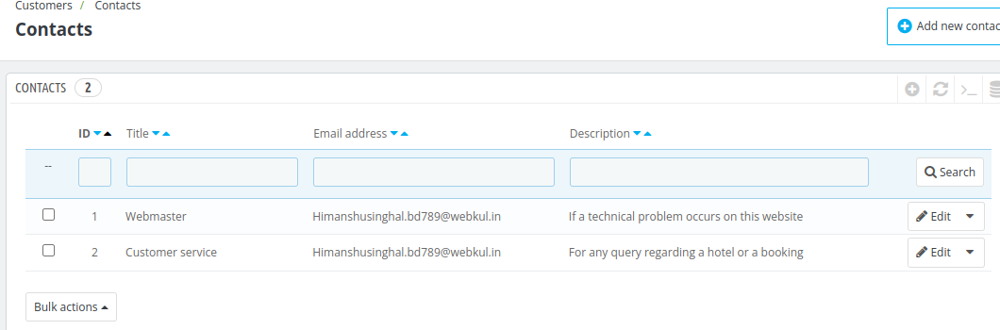
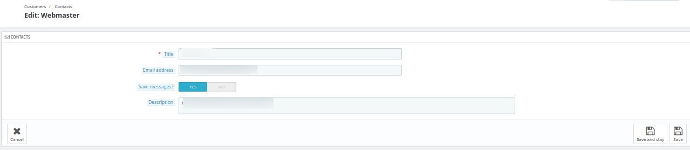

# Contacts

From this section,the admin can improve communication with customers by creating multiple contact accounts. For example: customer service, admin, hotel manager, etc.

This feature will allow your customers to directly contact the right person according to their needs.

## Add a new contact

To add a new contact, click on add a new contact button. Here, the admin will have to enter the following details:

**Title:** Enter contact title.

**Email Address:** Email where the customer messages will be received

**Save messages:** If enabled, all the messages will be saved in the **"Customer Service Page"** under the **"Customers menu"**.

**Description:** Enter the description of the contact.

Now Click on the Save button to add the contact

## Edit contact

Click on the edit button of the contact. Here, the admin change the following details:

- Title

- Email Address

- Save messages

- Description

