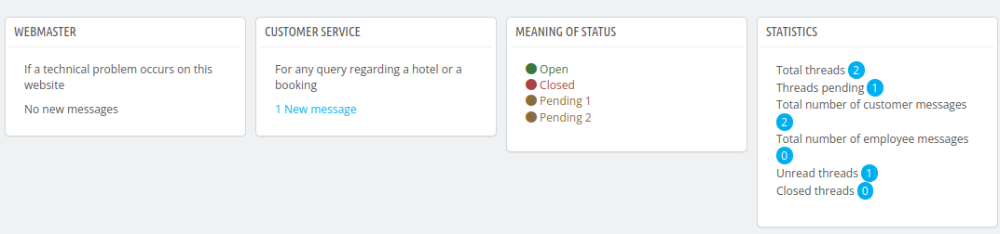
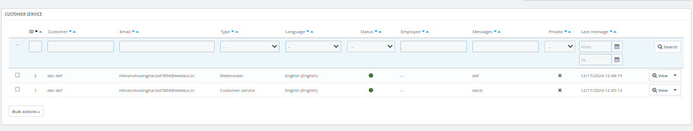
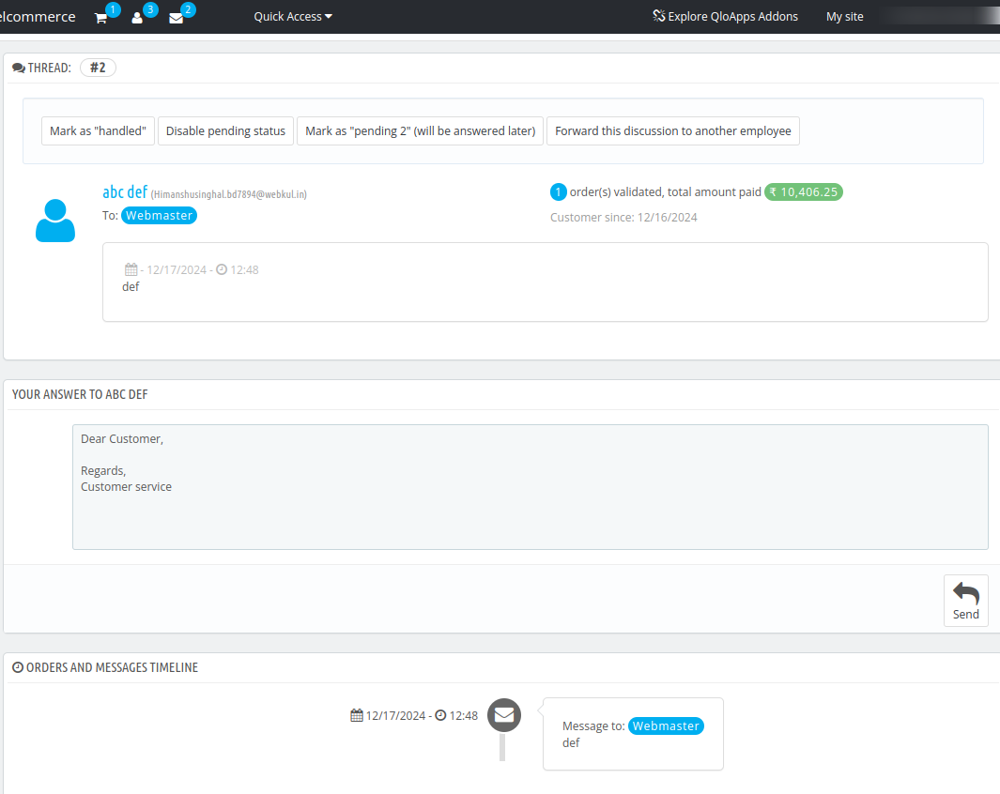

# Customer Service

The customer service page centralizes all customer requests in one place.

It displays all queries raised by customers, whether they are related to bookings or any technical issues.
 This helps you track which discussion threads need a response, eliminating the need to check email recipients to see if someone has already replied.

## KPI Metrics

Here, you will find different KPI blocks such as:

- **Pending discussion thread:** It will display the no of unanswered thread.
- **Average response time:** Average time of answering the response.
-   **Messages per thread:** It is the ratio of total messages with the number of threads.

- **Webmaster:** This section shows the no. complaint raised that are related to any technicality issue.

- **Customer Service:** This section shows the no. of queries raised regarding the hotel or a booking.

- **Meaning of status:** It will display the status:
    - Open: When the thread needs to be answered
    - Closed: When the thread's status is resolved.
    - Pending 1: When the thread's status is changed to pending 1
    - Pending 2: When the thread's status is changed to pending 2

- **Statistics:** It will display the following stats:
    - Total Thread
    - Threads pending
    - Total number of customer messages
    - Total number of employee messages
    - Number of Unread threads
    - Number of Closed threads

    

 ## View Customer Service

Here, you can view all customer queries along with the following details: Query ID, Customer Name, Customer Email, Query Type, Language, Status, Employee handling the query, Customer's detailed message, private notes, and the Date & Time of the last customer message.

Additionally, you can filter by Language, Status,and Employee, and view the Messages, including Private notes and the Last Message.

By clicking on the "View" option at the end of a customer's query, the admin can:

- View the number of threads
- Forward the discussion to another employee
- Change the status of the query,
- Write a reply to the customer, and
- View the timeline for the order and messages.

## Contact options

In this block, the admin can enable/disable the option to allow customers to upload an attachment.

**Default Message:** Here, the admin can fill out the message fields that appear by default when you answer a thread on the customer service page.

## Customer Service Options

In this block, the admin can enter the following details:

- **IMAP URL:** URL for your IMAP server (i.e. mail.server.com)
- **IMAP Port:** Port to use to connect to your IMAP server.
- **IMAP user:** User to use to connect to your IMAP server.
- **IMAP password:** Password to use to connect your IMAP server.

Admin can also enable/disable the following options:

- **Delete messages:** If enabled, you can delete messages after synchronization. If this option is disabled then the synchronization will take more time.
- **Create new threads:** If enabled, you can create a thread for unrecognized emails.
- **IMAP options (/norsh:)** Do not use RSH or SSH to establish a pre-authenticated IMAP sessions.
- **IMAP options (/ssl):** Enable this option to use the Secure Socket Layer (TLS/SSL) to encrypt the session.
- **IMAP options (/validate-cert:)** Enable this option to validate certificates from TLS/SSL server
- **IMAP options (/novalidate-cert:)** Enable this option to not validate certificates from TLS/SSL server. This is only needed if a server uses self-signed certificates.
- **IMAP options (/tls:)** enable to force use start-TLS to encrypt the session, even with servers that support it.
- **IMAP options (/notls:)** Do not use start-TLS to encrypt the session, even with servers that support it.

