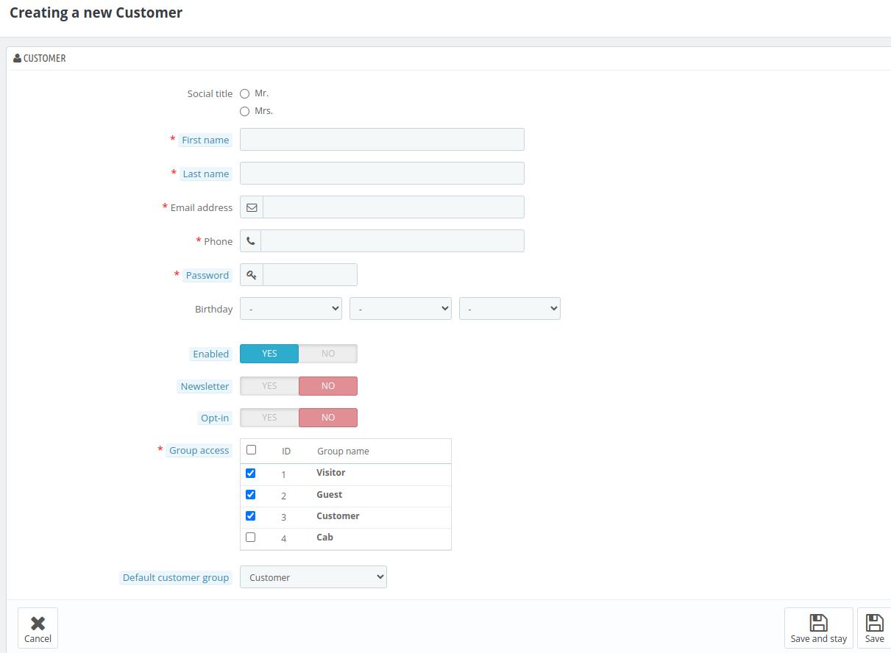
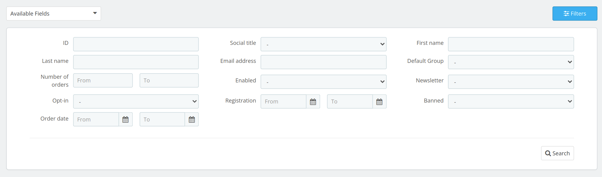
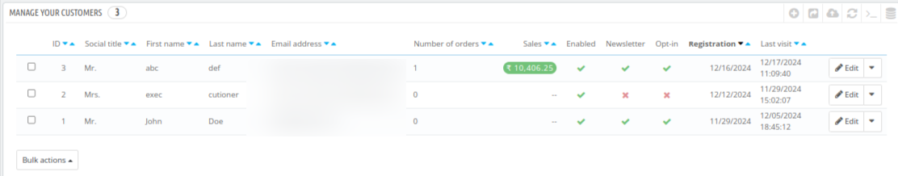
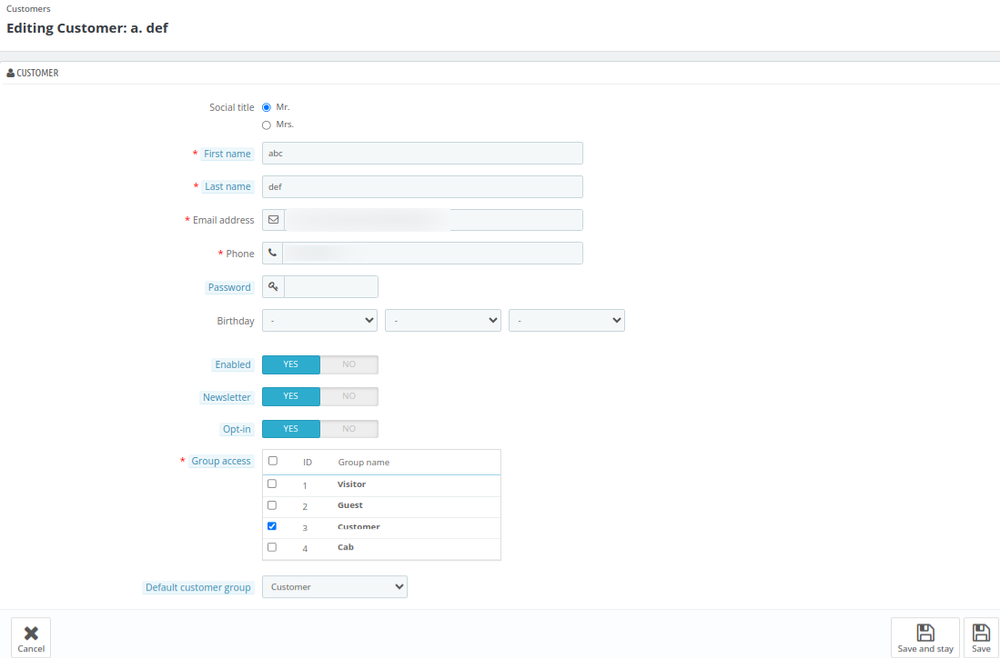
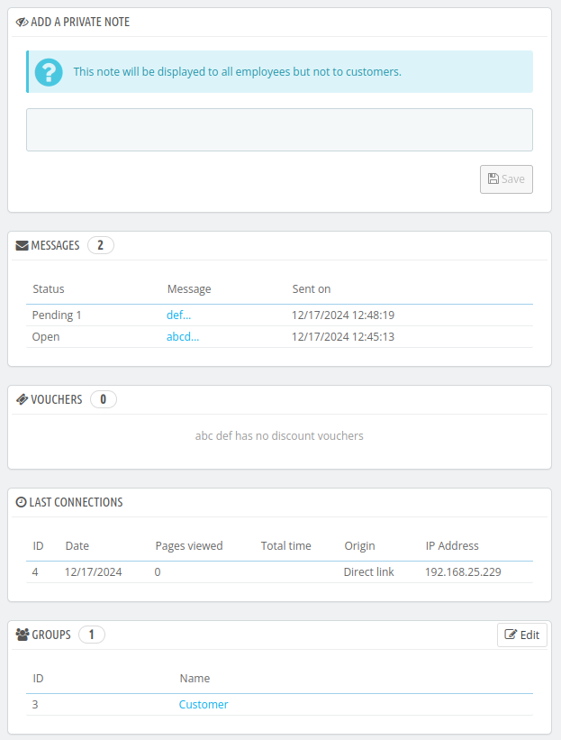
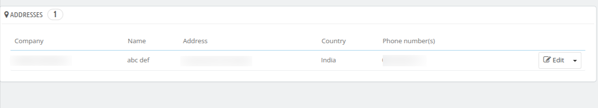

# Customers

 The customer section allows hoteliers to add new customers or edit details of existing ones, ensuring accurate and up-to-date records.

 Additionally, it includes some KPIs to monitor customer metrics and drive better decision-making.

 ## KPI Metrics

 - **Orders per customer** - It shows the average number of orders placed per customer in the given period of time.
- **Total frequent customers**- It shows the total number of frequent customers in the given period of time.
- **RevPAC**- Here we can see the revenue generated per available customer in the given period of time.
- **Total newsletter registration**- It shows the total number of customers who register with the newsletter in the given period of time.
-**Conversion rate**- This section shows the total percentage of visitors who successfully created a booking in the given period of time.
- **New customers**- Total number of new customers registered in the given period of time.
- **Banned customers**- Total number of banned customers.
- **Customers** main gender of all the customers.

You can modify the customer KPI settings by navigating to **Preferences > Customers > Customer KPI Configuration**.

## Add a new customer

Click on add new customer to add a new customer.

After clicking on the edit button, the admin will view the following fields:

- **Social Title:** Choose a title for the customer. (Mr. or Mrs.)
- **First name:** Enter the first name of the customer.
- **Last name:** Enter the last name of the customer.
- **E-mail address:** This email will be used for customer login.
**Phone**: Enter phone number of the customer.
- **Password:** Enter the password, at least 5 characters long.
- **Birthday:** Select the date, month, and year respectively from the dropdown.
- **Enabled:** Enable or disable the customer login.
- **Newsletter:** If enabled, this customer will receive your newsletter through email.
- **Opt-in:** Opt-in to receive e-mails.
- **Group access:** Select all the groups that you would like to apply to this customer. Customer groups allow you to create group discounts. Many other Qloapps features can also be group-restricted.
- **Default customer group:** This will be the user's default group. This group will be used to determine the price display, tax rules, and applicable discounts for the customer.

Now click on the Save Button.

## Filters

This section allows you to view details based on the following fields:

**ID:** Unique identifier for each customer.

**Social Title:** Salutation such as Mr., Mrs., or Ms.

**First Name & Last Name:** Customer's first & last name.

**Email Address:** The customer's registered email.

**Default Group:** The primary group assigned to the customer.

**Number of Orders:** Total no. of  orders placed by the customer.

**Enabled**: Indicates if the customer account is active.

**Newsletter:** Shows if the customer has subscribed to the newsletter.

**Opt-in:** Indicates if the customer has agreed to receive marketing emails.

**Registration:** Date the customer registered.

**Banned:** Displays if the customer's account is banned.

You can use the filter option to narrow down the list based on any of these criteria.

## Manage your Customers

Under manage your customers block, you will find the list of all of your customers.

### Edit a customer

You can edit an existing customer simply by filling out the fields, just as you did while adding a new customer.

### Delete a customer

By clicking on the down arrow, the admin can delete the customer

### View a customer

By clicking on the down arrow, the admin can view the customer's details. Here, the admin can see the customer's information in various blocks such as:
In this block, the admin can see the basic information such as:

### Customer Information

- **Social Title:** Title (Mr. or Mrs.)
- **Phone:** customer's phone number.
- **Age:** Age of the customer
- **Registration Date:** Date on which the customer is created
- **Last Visit:** Date on which the customer last visited the website
- **Best Customer Rank:** This will display the customer's rank. (Customer's rank will be according to their spending)
- **Language:** Defeault Language selected by the customer.
- **Registrations:** It will display the options, that are enabled for the customers. That is newsletter and opt-in.
- **Last Update:** It will display the date and time, when was the customer last updated.
- **Status:** Will display if the customer is active or inactive.

#### Orders

In this block, the admin can see the number of valid and invalid orders created by the admin.

#### Carts

It will show the real-time information of the customer's cart. It will display the details, whenever customer add a room in the cart.

#### Roomtype and services

Here, the admin can view all the types of rooms and services booked by the customer.

#### Add a private note

Here, the admin can add a private note on the customer. This note will be displayed to all the employees but not to the customers.

#### Messages

Here, the list of all the messages that are sent from the admin to their customers will be displayed.

#### Vouchers

All vouchers associated with this customer will be displayed here. The admin can view, edit, or delete these vouchers as needed.

The admin can create vouchers from **Price Rule > Cart Rules > Add new cart rule**

#### Groups

The admin can view and modify the group assigned to the customer.

#### Addresses
All the addresses associated with customer booking will be visible here.

