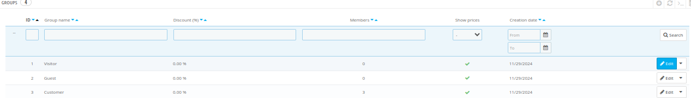
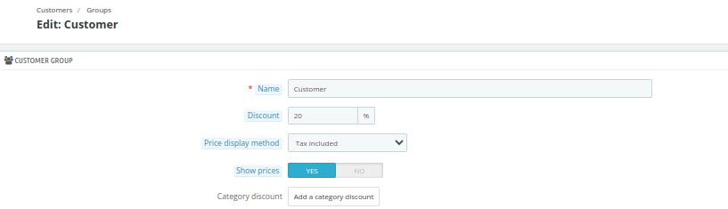
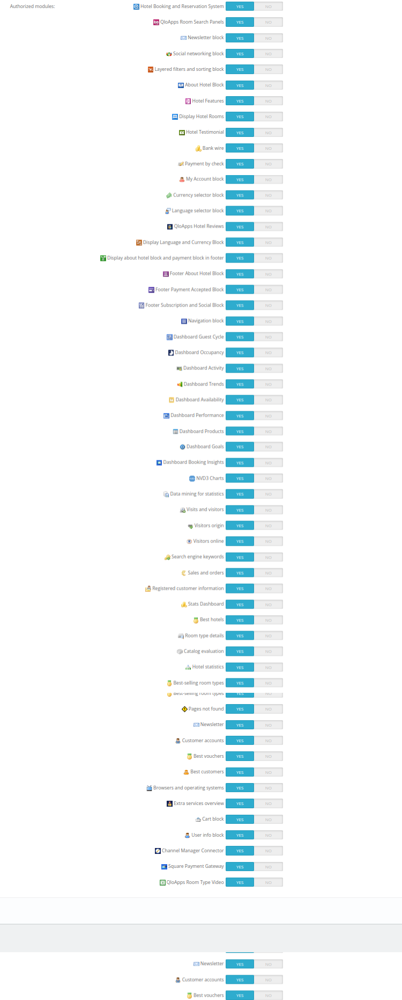

# Groups

Here, all the groups will be displayed along with their details such as ID, group name, discounts, and no. of members in that group.

Additionally, the admin can create new groups based on the priority or preferences of the guests.
**QloApps** has three default customer groups:

- **Visitor** - All persons without a customer account or customers who are not logged in.
- **Guest** - All persons who placed an order through Guest Checkout. (Without creating the account)
- **Customer** - All persons who created an account on this site.

The admin can Add, edit, and view the groups from here.

## Add a new group

Click on add a new group option to create a new group.

Here, the admin will have to enter the following details:

- **Name:** Name of the group

- **Discount:** If you want to give a discount to this group then enter the value else leave it 0

- **Price display method:** Select whether you want to show tax-included price or tax-excluded price.

- **Show prices:** Customers in this group can view prices.

Click on the save button to create the group

## Edit Group

Click on the edit button of your desired Group.

Here, the admin can change the following fields:

- **Name:** Name of the group

- **Discount:** If you want to give a discount to this group then enter the value or leave it 0

- **Price display method:** Select whether you want to show tax included price or tax excluded from the dropdown

- **Show prices:** Customers in this group can view prices.

- **Category Discount:** Here the admin can add the category discount to this group.

After clicking on add category discount, the admin can choose the category.

**Note:** The discount applied to a category does not stack with the overall reduction but instead replaces it.

- **Authorized Module:** Here, the admin can enable or disable which modules are displayed on the frontend for a specific group..

