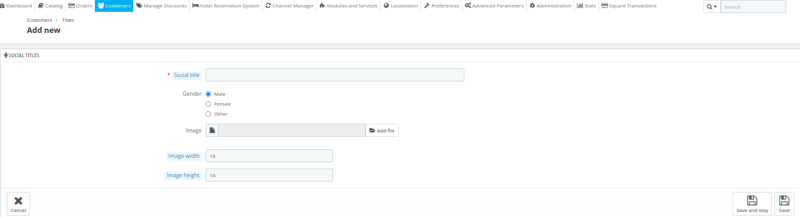

# Titles

The Titles section in QloApps allows you to manage and customize the titles used for addressing customers.

This feature enables you to create, edit, or delete titles such as Mr., Mrs., Ms., Dr., and others.

By configuring this section, you can ensure a personalized experience for your customers throughout the booking process and communication.

## Add a new title

To add a new Title, click on add a new title button. Here, the admin will have to enter the following details:

**Social title:** Enter the name of the new title here.

**Gender:** Select the gender for the title.

**Image:** Upload the images for the title.

**Image width:** Enter the width of the image.

**Image height:** Enter the height of the image.

## View Titles

From this section, You can view/edit all the titles available.

## Edit a title

To edit a title click on edit and You can edit all the following details that you entered while adding a new title.

