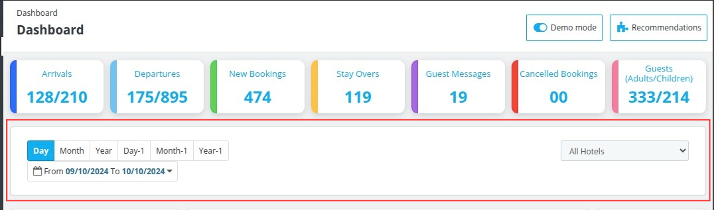

# Filter Data

This row provides you with various options using which you can filter the data based on days, months, years, and even date ranges. You can also select which property statistics you want to see on your dashboard.

These various filter options will help you view and manage all your booking records efficiently.

### Various ways in which you can filter the data you want to see on your dashboard are:

- **Day:** View your property's statistics for the **current day** only.

- **Month:** Display data and statistics of your hotel for the **current month**.

- **Year:** View the data and statistics of your hotel for the **current year**.

- **Day-1:** View the data and statistics of your hotel for the **previous day**.

- **Month-1:** View the data and statistics of your hotel for the **previous month**.

- **Year-1:** View the data and statistics of your hotel for the **previous year**.

- **Mini Calender:** Use the calendar option to select a **custom date range**. This allows you to filter and display data between two specific dates (e.g., From 09/10/2024 to 10/10/2024).

- **Hotel Dropdown:** By default, the dashboard displays data for all properties. Use the dropdown to select a specific property or keep it on "all hotels" for an overall view.

By using these filters, you can efficiently monitor and analyze booking trends, cancellations, guest counts, and other critical statistics, all from your QloApps dashboard.

