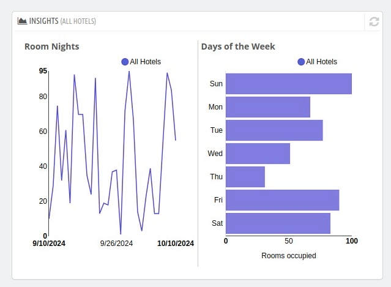

# Insights
The Insights section in the dashboard allows you to compare and identify trends across locations, helping you make strategic decisions for all properties.

The **Insights** section is crucial for understanding guest behavior and optimizing operations. By analyzing metrics like **length of stay**, **room nights**, and **days of the week**, you can:
- Tailor promotional campaigns.
- Adjust room pricing dynamically.
- Manage resources efficiently during peak periods.

Here's an explanation of each metric under this section:

## Length of Stay (%)

- **Definition:** Represents the percentage distribution of guests' stays based on their duration (e.g., 1 night, 2 nights, 3+ nights).

It also displays the data of number of rooms booked per number of nights.
It displays the percentage of various lengths of stays at the hotel.

## Room Nights
- **Definition:** The total number of rooms occupied across all properties for the selected period.

- **Purpose:** Provides insight into total occupancy levels, helping you track room utilization and forecast demand.

## Days of the Week

  It shows that which days see the highest bookings.

**Application:** Use this data to implement targeted promotions (e.g., weekend discounts) or prepare staff for peak days.

**Example:**
- **Monday:** 20% of total bookings
- **Friday-Saturday:** 50% of total bookings
Suggests that weekends are the busiest, requiring better resource allocation.

