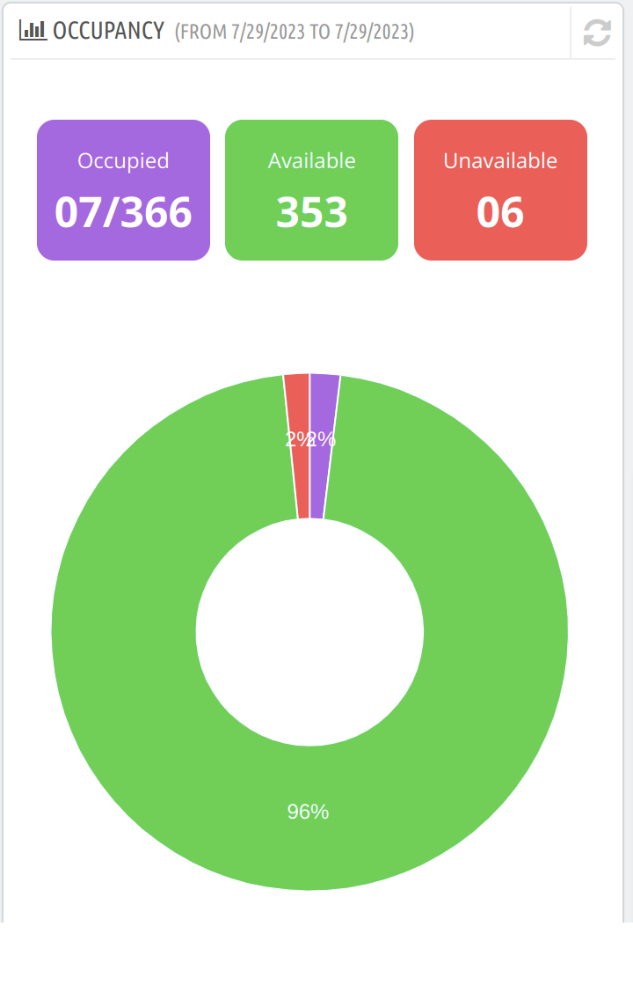

# Occupancy

It displays data on the occupancy of the hotel rooms under 3 categories:

- **Occupied**: The total number of rooms booked for date ranges out of a total number of rooms.
- **Available**: The number of rooms available for booking in the date range.
- **Unavailable**: The number of rooms unavailable for booking in the date range.

The pie chart demonstrates the percentage of occupied, available and unavailable rooms.

