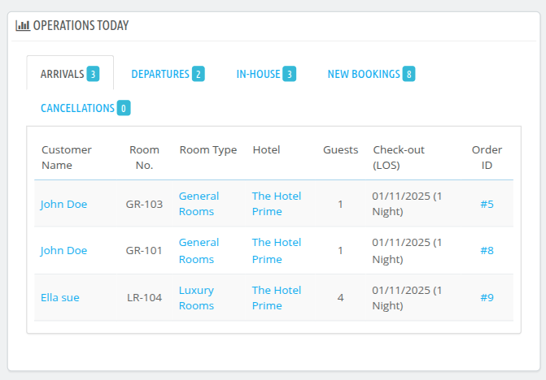
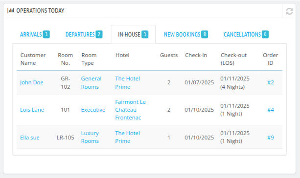

# Operations Today
The "Operations Today" section of the dashboard provides an overview of the day's key operational metrics and booking details for the property.

This displays the data of your hotel's daily operations.

**1. Arrivals**

This indicates the number of guests expected to check in today.

**2. Departures**

This shows the number of guests expected to check out today.

**3. In-house**

This represents the total number of guests currently staying at the property.

**4. New Bookings**

This refers to the number of bookings or reservations made today.

**5. Cancellations**

This highlights the number of bookings cancelled today.

**Table Details:**

The table below these metrics provides more granular data about guests and their bookings. The columns are as follows:

- **Customer Name**: The name of the guest associated with a booking.

- **Room No.**: The specific room number allocated to the guest.

- **Room Type**: The type or name of the room booked (e.g., Deluxe, Suite, Standard).

- **Hotel**: The name of the property (useful if managing multiple properties in the system).

- **Guests**: The total number of guest coming with the particular booking.

- **Check-in (LOS)**: The check-in date and the length of stay (LOS) for the booking.

- **Check-out (LOS)**: The check-out date and the length of stay (LOS) for the booking.

- **Order ID**: The unique identifier for the booking.

- **Total Rooms**: The total no. of rooms reserved in the booking.

- **Order Total**: The total price or value of rooms reserved in the booking.

- **Order Status**: The Order status is the current status of the booking such as awaiting payment, complete payment has been received,partial payment has been received etc.

- **Request ID**: The unique identifier for the cancellation request on booking or reservation.

**Purpose:**
*This section is designed to give property managers or front-desk staff a quick snapshot of daily operations. It helps in tracking arrivals, departures, current occupancy, and any updates like new bookings or cancellations in real time.*