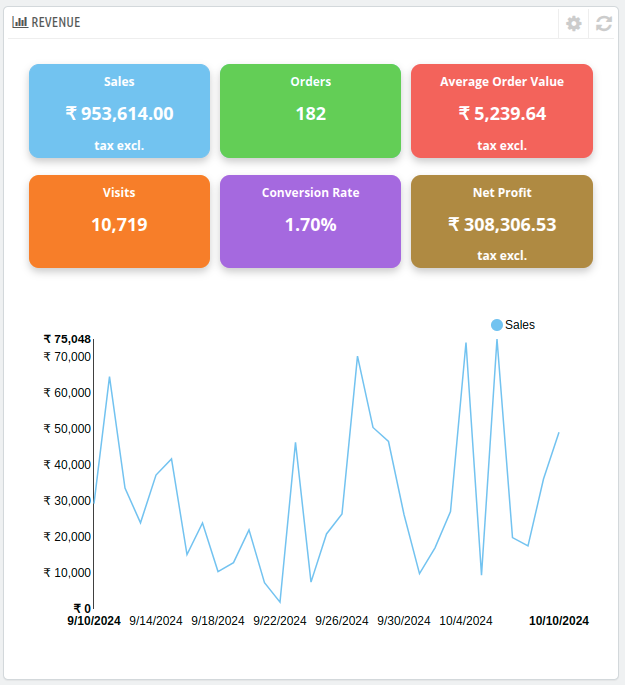

# Revenue
This Revenue section of the dashboard tab provides a summary of your property's financial performance.

### Here's a breakdown of the metrics displayed:

**1. Sales**
- Represents the total revenue generated from all sales during the selected period, excluding taxes.

**2. Orders**
- Indicates the total number of confirmed bookings or orders made by customers during the period.

**3. Average order value**
- Shows the average revenue earned per order.
- Formula:
 **Average Order Value = Total Sales / Total Orders**

**4. Visits**
- Displays the total number of visits to your website during the selected timeframe.

**5. Conversion Rate**
- Refers to the percentage of website visits that resulted in confirmed bookings or orders.
- Formula:
**Conversion Rate (%) = (Orders / Visits) × 100**

**6. Net Profit**
- Represents the total earnings after deducting all operating costs and expenses, excluding taxes.

- You can configure or input the operating costs and expenses by clicking on the **configuration icon** above this section.

- **Usage Note**:
The **net profit** calculation allows you to assess the financial health of your property. By providing accurate operating costs, you can ensure this metric reflects a realistic picture of your profitability.

**NOTE: You can monitor the performance for each day of above metrics through their graphs on the dashboard by clicking on that metric. The graph will not be visible when data is filterd for a single day.**

