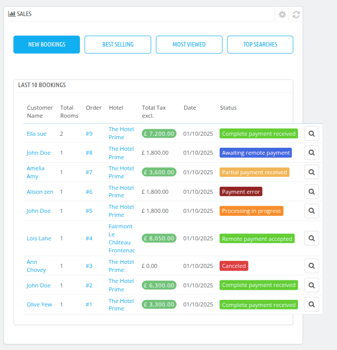
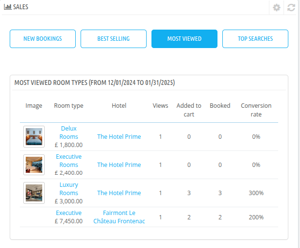
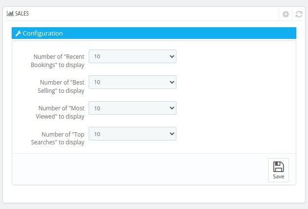

# Sales

The Sales section of the dashboard tab provides detailed insights into booking activities, customer preferences, and overall property sales performance.

  Below is a breakdown of its components:

## **Key Sections**

### **1. New Bookings**

### **2. Best Selling**

### **3. Most Viewed**

### **4. Top Searches**

## **Configuration Options**

- **Number of "Recent Bookings" to Display:** Set the number of latest bookings to show in the dashboard (e.g., 10).
- **Number of "Best Selling" to Display:** Configure how many best-selling items to show.
- **Number of "Most Viewed" to Display:** Adjust the number of most-viewed items displayed.
- **Number of "Top Searches" to Display:** Set how many top search terms are visible.

This section ensures you stay updated on sales performance and helps refine your strategies for better profitability and customer satisfaction.

