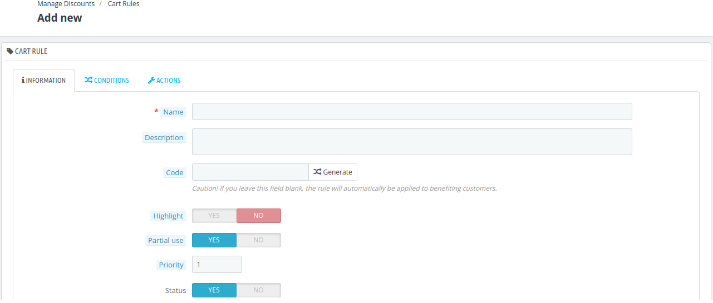
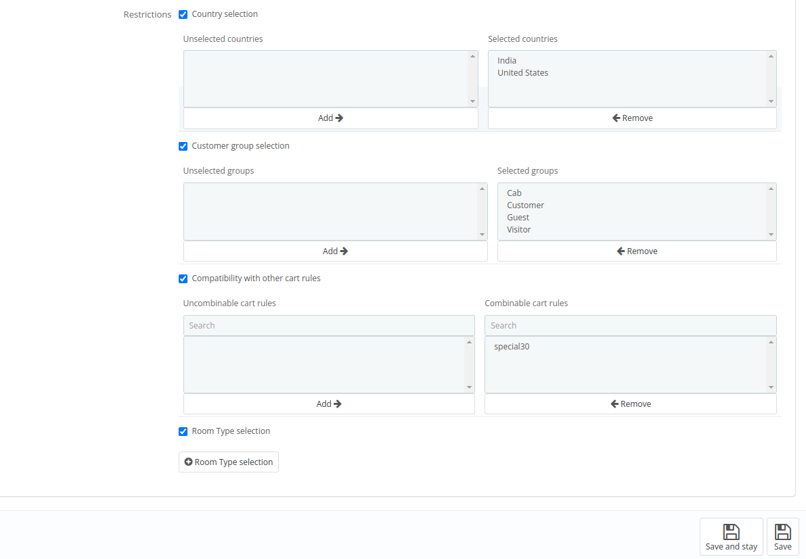
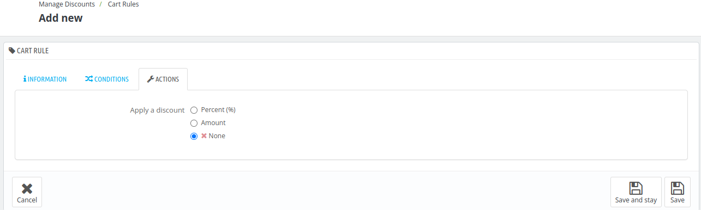
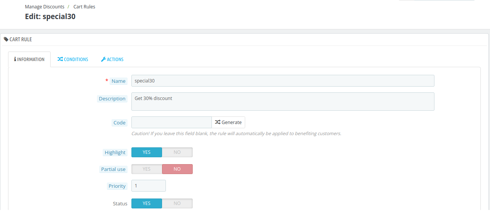

# Manage Discounts

The Cart Rules section in QloApps allows hotel administrators to create and manage promotional discounts and offers for their guests.

These discounts can be tailored based on date ranges, minimum booking amounts, countries, customer groups, or room types.

## Add new Cart Rule

You can create a new voucher at any time manually. To add a new cart rule, click on Add new cart rule button.

Here, admin will have to add the details into the
following blocks:

- Information

- Conditions

- Actions

### Information

The **Information** block in QloApps contains the key identifiers and settings for cart rules.

Administrators must provide details such as:

- **Name:** This name will be displayed in the cart summary.
- **Description:** This field is only for the admin. This description will never be displayed to the customers.
- **Code:** Give your rule a unique code. You can either create one manually or have system generate one unique string by clicking the **"Generate"** button. This is the code that user will enter to apply voucher to a cart.
- **Highlight:** If enabled, then voucher code will be displayed in cart summary if the it is not yet in the cart.
- **Partial Use:** Determines handling of unused voucher value. If **not allowed**, the voucher value adjusts to match the cart total.
If **allowed**, a new voucher is created for the remaining value..
- **Priority:** Set the priority of the cart rules. A cart rule with a priority of **1** will be processed before a cart rule with a priority of **2**.
- **Status:** To enable or disable the voucher.

### Conditions

The **Conditions** tab offers a wide range of options to help administrators target specific users or situations for applying the cart rule.

In this section, the admin can configure the following details:

- **Limit to a single customer:** Here admin can search for the customer to whom this voucher will be applicable.

**Note:** This field is optional.The cart rule will be available to everyone if admin choose to leave this field blank.
- **Valid:** Enter the start date and end date of this voucher. The default period of the voucher is one month.
- **Minimum amount:** The admin can set a minimum cart amount required to apply the rule, with the option to choose whether the amount is calculated with or without taxes. Additionally, the admin can select the currency for the voucher.
- **Total available:** The cart rule will be applied to first **X** customers only.
- **Total available for each user:** A customer will only be able to use the cart rule **X** times.

- **Restrictions:**  the admin can set additional restrictions to refine the application of cart rules. These include:

**Country Selection:** Apply the cart rule to customers based on their country of origin

**Customer Group Selection:** Target specific customer groups, such as loyal customers or corporate clients.

**Compatibility with Other Cart Rules:** Define whether the rule can be combined with other cart rules or used exclusively.

**Room Type Selection:** Apply the rule to specific room categories, such as deluxe or standard rooms.

### Actions

The **Actions** block is where you define the specifics of the discount. Here, the admin can decide the type of discount to apply, such as a percentage, a fixed amount, or no discount at all.

## Cart Rules
Once the discount is created, it will be displayed on the Cart Rules page. Here, you can view, manage, and edit all your active and inactive discounts in one place

## Edit a cart rule

Click on the edit button to edit the cart rule.

Here the the admin can modify the details in the **Information, Conditions, and Actions** tabs as previously discussed.