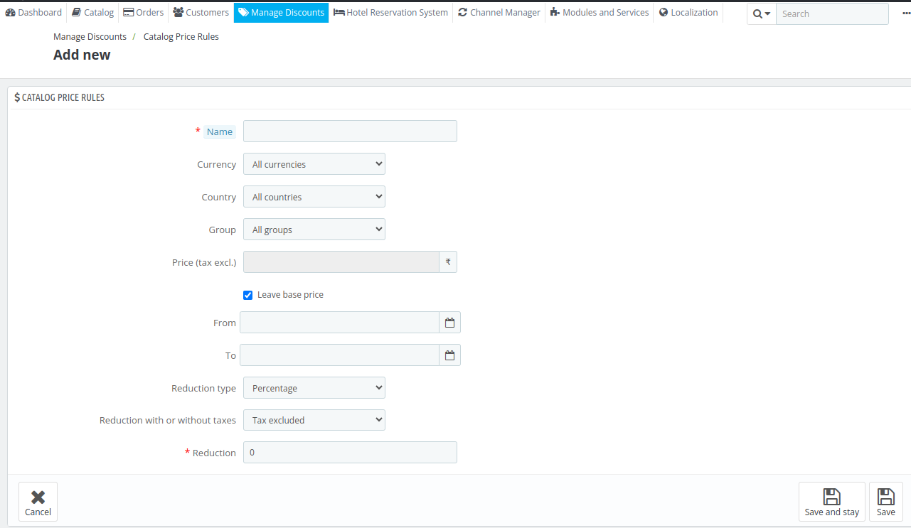
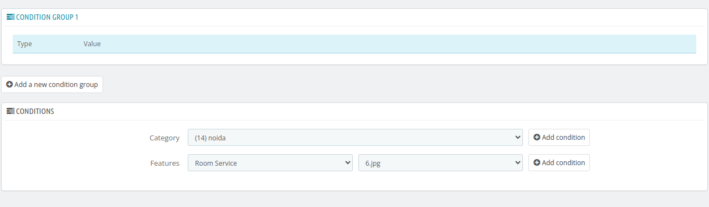
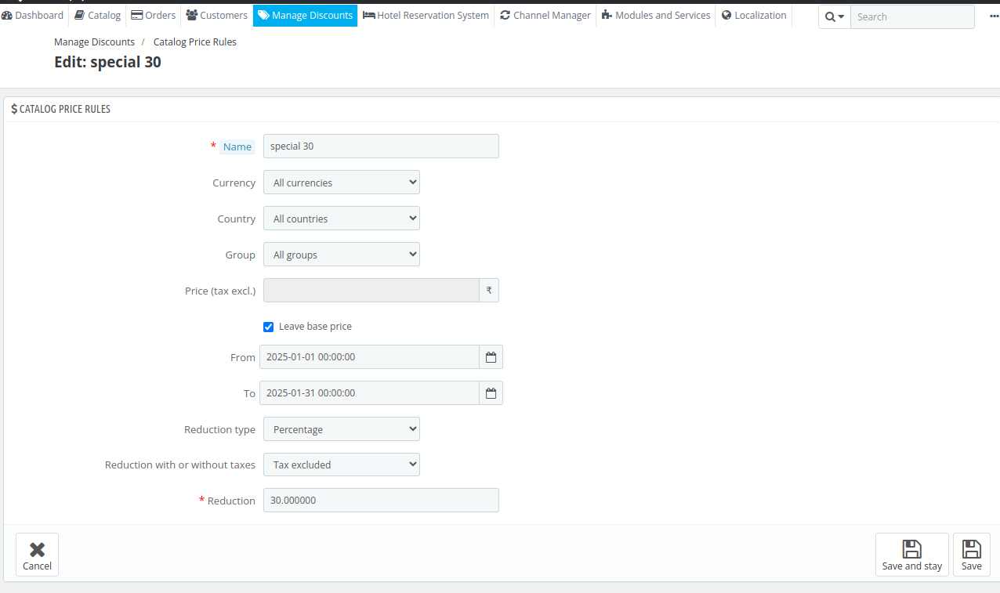

# Catalog Price Rules

Catalog Price Rules allow you to assign price reductions based on categories, applying discounts to a range of products rather than a single product. With Catalog Price Rules in QloApps, you can offer discounts on your hotel rooms based on criteria such as currency, country, or customer groups.

## Add new catalog price rule

To add new catalog click on add new catalog price rule.

Here, the admin will have to enter the following details:

- **Name:** Enter the name of the rule.

- **Currency:** If you want to give a discount to a customer paying in a specific currency, then select the currency from the drop down.

- **Country:** If you want to give a discount to the customers of a specific country then select the country here.

- **Group:** Select the particular group, to whom you want to give the discount

- **Price (tax excl.):** Here you can enter apply discounts to a selected price (either the base price or a new price). By default, the rule applies to the base price, but you can choose a new price (like a discounted rate) and then apply the discount on that.

- **From and To:** Select the time validity from calendar dropdown.

- **Reduction type:** Discounts can be applied either as a percentage (e.g., 10% off) or as a fixed amount (e.g., ₹500 off).

- **Reduction with or without taxes:** Specify whether the discount applies to the price including taxes or excluding taxes.

- **Reduction:** The actual value of the discount.

After filling all the information click on save button and the rule will be created.

### Add new condition group

In the "Conditions" section, you define the products the catalog price rule will apply to.

- To start, click **Add a new condition group** to make this section visible.
- If no conditions are set, the rule will apply to all products in your catalog by default.
- You can build condition groups by selecting categories and features  and adding conditions using the **Add Condition** button.
- Multiple conditions within a group allow for precise targeting of product ranges.

## Edit Catalog price rule

Click on edit button to edit the catalog price rule.

Here The admin can edit the following fields  as previously discussed.

- Name

- Currency

- Country

- Group

- Price (tax excl.)

- Date Range

- Reduction type

- Reduction with or without taxes

- Reduction

