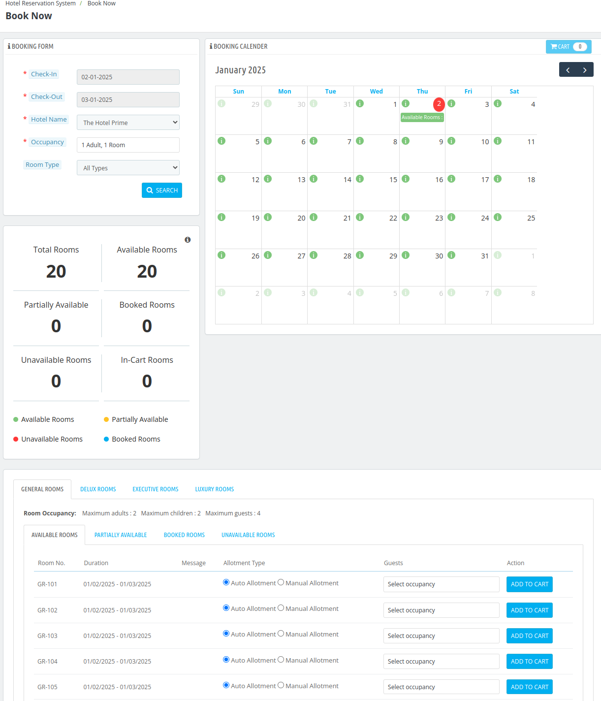
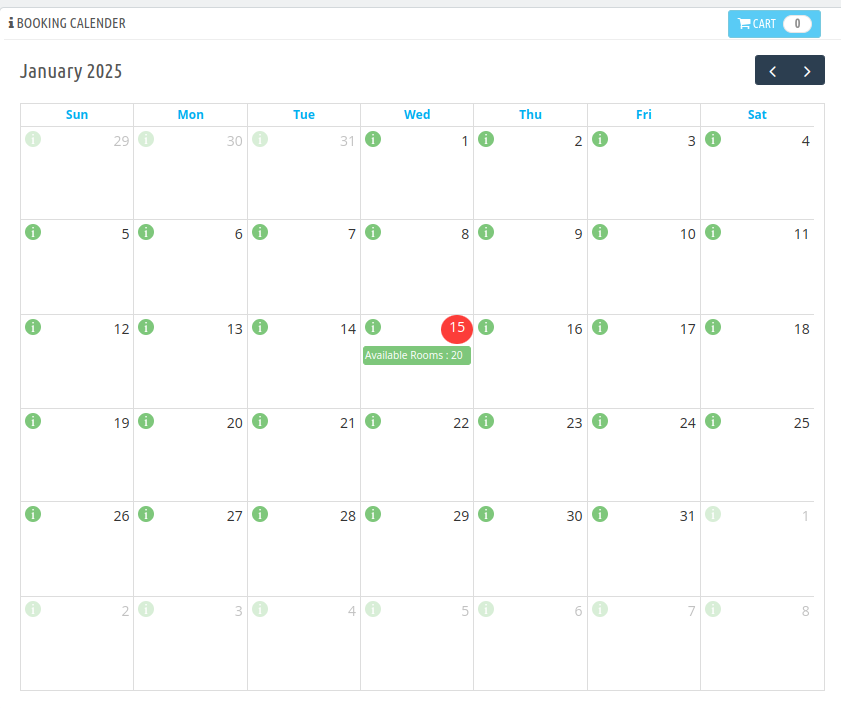
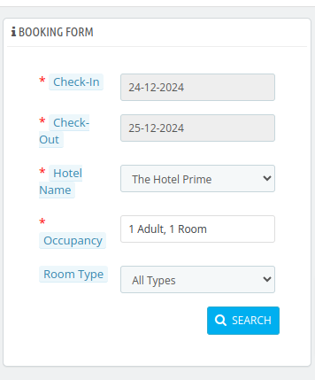
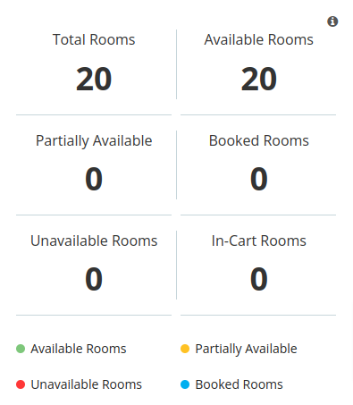
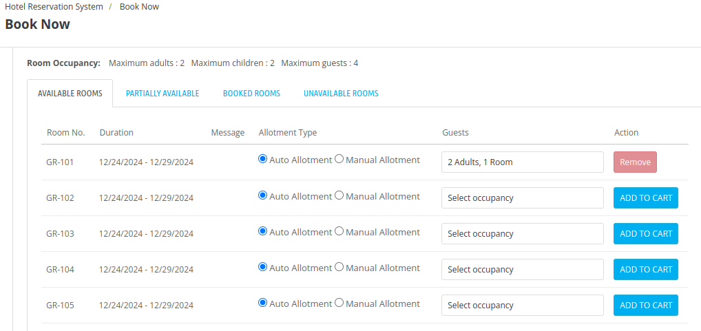
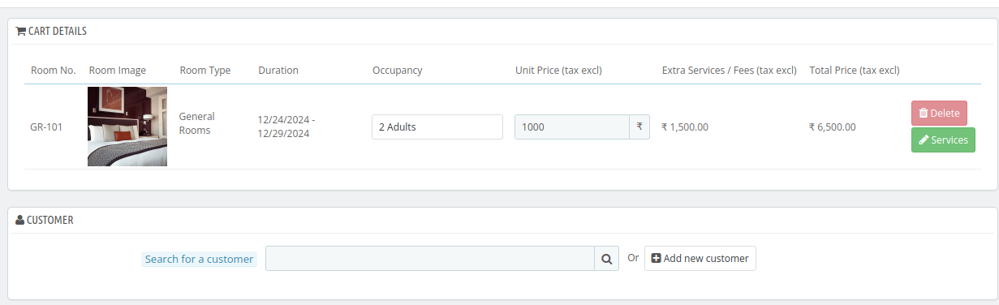
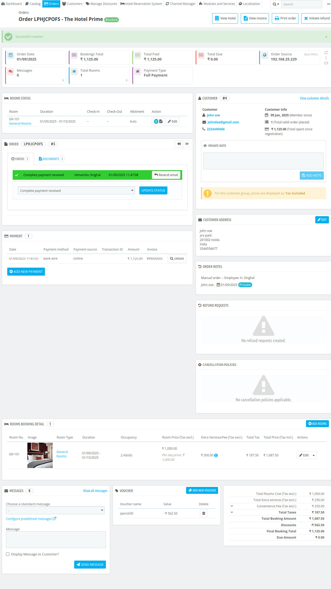
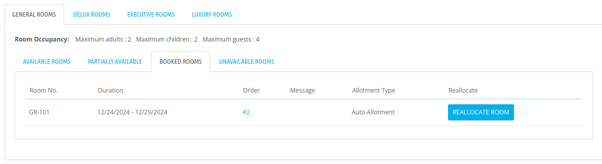
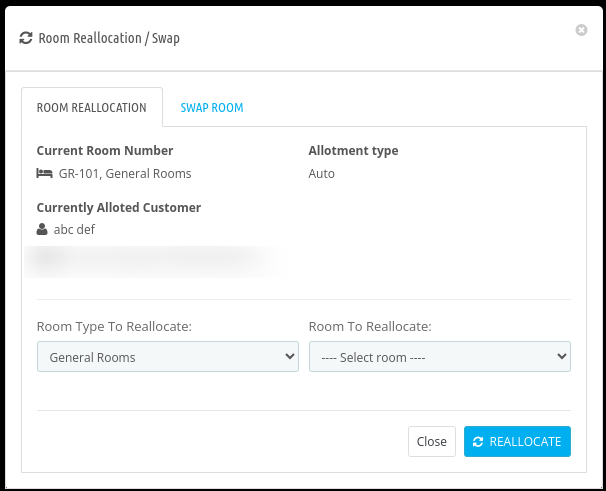

# Book Now

From Book now page, the admin can do the following things:

- Create bookings from the back office for walk-in guests.
- View the status of all the rooms in a single glance.
- View the booking calendar to track and manage reservations.
- Reallotcate/swap room manually based on availability and guest preferences.

## Booking Calendar

The booking calendar will display all the available, partially available, Booked rooms on the calendar. This section will help the admin to view the status of all the rooms with the date range in a single glance.

Admin can hower on the 'i' icon to see the room status of that particular date.

## Booking Form

With the booking form, the admin can search based on the following fields to view reservations and book new ones:

- **Check-in Date:** Search rooms based on the guest's arrival date.
- **Check-out Date:** Seachr rooms based on the guest's departure date.
- **Hotel name:** Select your hotel from here.
- **Room Type:** Select a specific room type from the dropdown menu.
- **Occupancy:** Filter rooms based on the number of guests.

Click on search to proceed.

Below the booking form, the status of all rooms will be displayed for the selected date range such as:

- **Total Rooms:** The total number of rooms the property has.
- **Available Rooms:** The number of rooms that can be booked for the selected date range.
- **Partially Available Rooms:** Rooms that are not fully available for the entire selected date range.
Example: If the date range is 3 days, and Room 1 is booked on Day 1 while Room 2 is booked on Day 2, then two rooms are partially available for the selected period.
- **Booked Rooms:** Rooms that are already reserved for the selected date range.
- **Unavailable Rooms:** Rooms that cannot be booked due to maintenance or other reasons.
- **In-Cart Rooms:** number of Rooms currently added in guest's cart.

The availability of rooms will be displayed on the booking calendar.

## Book a new room

To create a booking from the back office, the admin will have to fill the details given in the **Booking Form**. Then click on search.

All the room types which are available for that particular duration will be displayed.

After that, the admin can select the rooms for the particular room type by adding the room to the cart.

Enter the occupancy and set the allotment type to auto or manual (Admin can enter a custom message if the manual allotment is selected).

Once the rooms are added, the admin can proceed with the booking by clicking on the cart icon above the calender.

In cart options order details will be displayed such as room number, room type, duration, and amount.

Admin can also remove the room from the cart.

Click on **Book Now** to proceed with booking.

#### Cart details

On the cart details page, the admin can also add **services** to the order, allowing customization of the booking with additional offerings or amenities.

#### Customer

Now, the admin must select an **existing customer** or **add a new customer**.

After adding or searching for an existing customer, The admin will have to click on Choose to proceed with the booking.

#### Cart

After that, under the cart section the admin can choose the currency and language for the cart.

#### Vouchers

If desired, the admin can provide a voucher to the customer. The admin can either search for an existing voucher or **create a new voucher** to apply to the order.

#### Addresses

Now, under the Address section, the customer's address is displayed. If needed, the admin can add or edit an exisiting address.

#### Summary

In the **summary** section, the admin can see the final price of the room which includes the total room price(Tax excl.), Convenience fees (Tax excl.), Total price (excluding tax), total vouchers,Total Taxes, and the Total Order Price (Tax included) and after that,

- **Order Message:** The admin can enter an order message to provide additional instructions or details for the customer.

**Note:** The admin can also send the payment link to customers via email. Additionally, the admin has the option to redirect to the hotel's front end page through the link shown in the image below.
- **Full Payment:** Choose Yes or No. Keep this option enabled for full payment and disable it for partial payment of the booking.
- **Payment Amount:** The total Paid amount (e.g., ₹7312.5).
- **Payment Source:** Select the source of the payment from dropdown.
- **Payment Method:** Select or type the method through which the payment will be made.
- **Transaction ID:** The unique ID associated with the payment transaction.(If required)

Then, Click on create the order and admin will be redirected to the order detail page.

## Reallocate/Swap Rooms

The admin can **reallocate or swap** a booked room for any order.

Under the **Booked Rooms** tab, select the room you want to reallocate or swap.

From there, choose an available room for reallocation or swapping.

