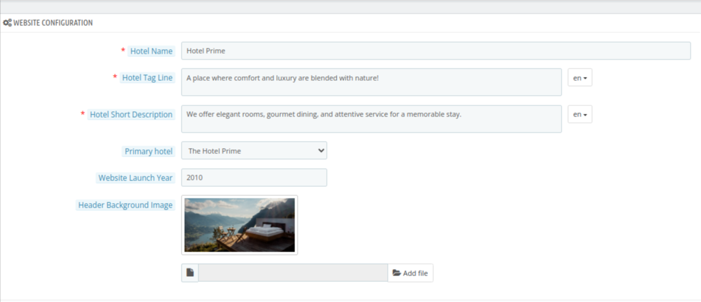
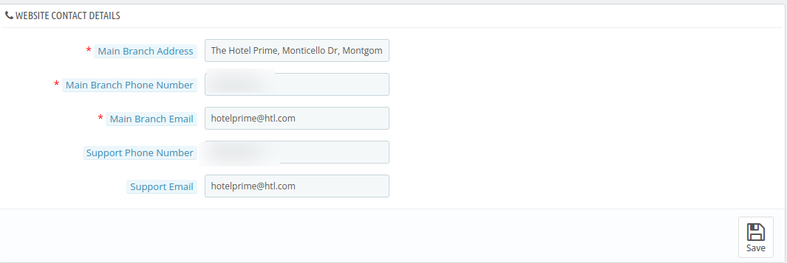
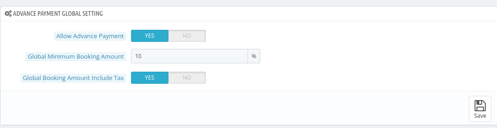
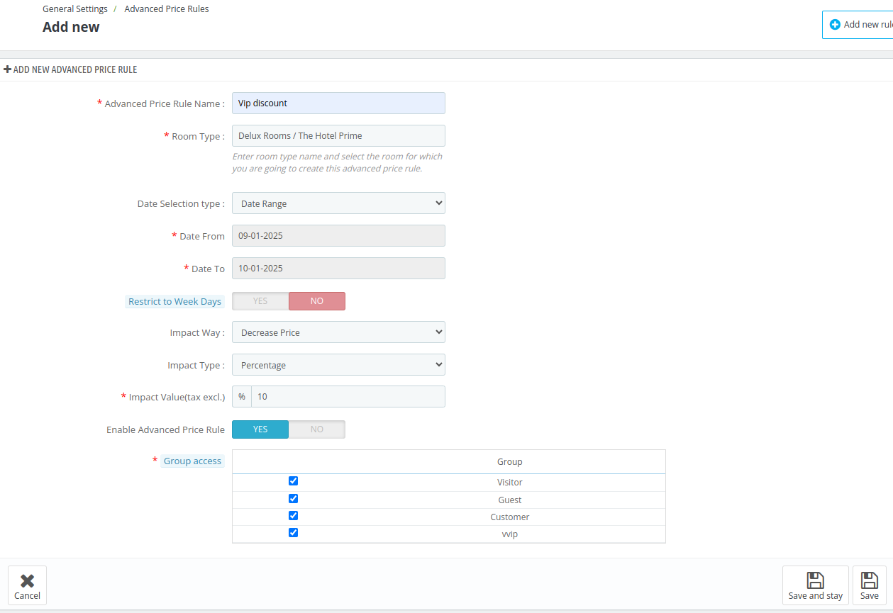
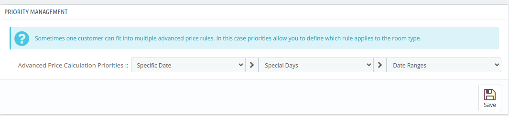
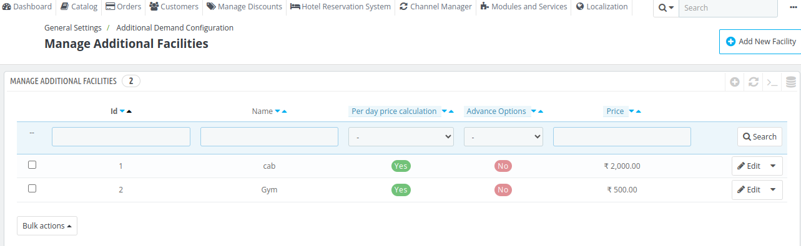
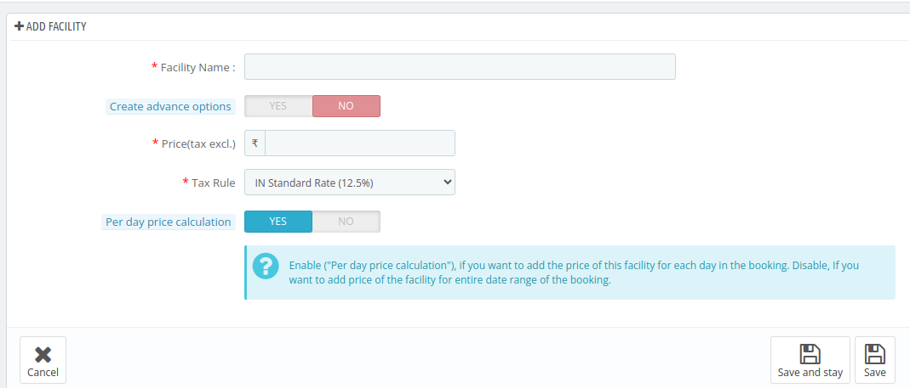
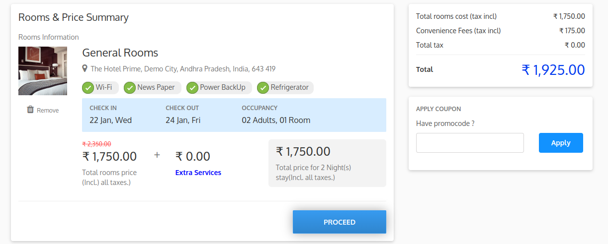
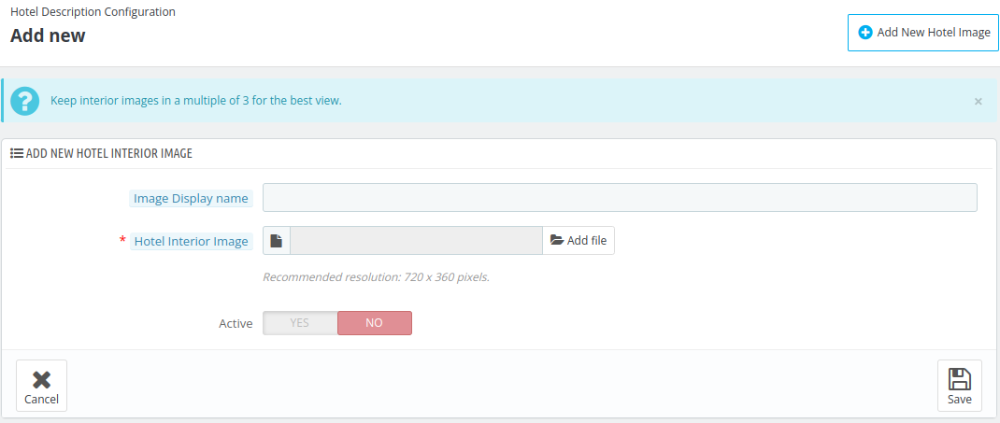
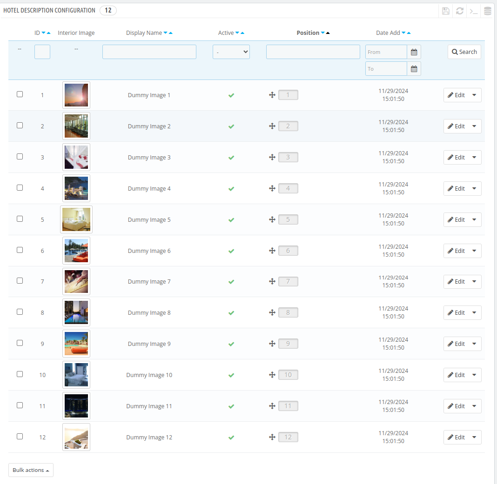

# General Settings

The Hotel General Settings section in QloApps is designed to provide hoteliers with centralized control over fundamental configurations for their property.

Here, the admin can access and manage the following settings:

- General Settings
- Advanced Price Rules
- Additional Facilities
- Hotel Interior Block
- Hotel Amenities Block

## General Settings

The General Settings section allows administrators to set the hotel's name, tagline, background image, description and much more.

Additionally, administrators can configure essential contact information, Advance Payment Global Settings, occupancy preferences, and Google Maps settings.

### Search Panel Settings

In the **Search Panel Setting** block the admin can enable/disable the following settings:

- **Enable Hotel Location:** Enable it to display the hotel location search field shown on the front page.
- **Display Hotel Name:** The name of the hotel can be enabled or disabled for display when managing a single property. However, if multiple hotels are being managed, the hotel name will automatically appear in the search panel.
- **Focus Next field automatically:** Enable it if you want the next booking search field to be focused automatically after setting value for a field.
- **Hotel name search threshold:** Enter the number of hotels after which user can search hotel by name.

### Website Configuration

In the ** Website configuration** panel,the admin can add the following details:

- **Hotel Name**: Enter the name of the hotel.
- **Hotel Tag Line**: This will display the hotel tagline in the hotel page.
- **Hotel Short Description**: This will display the hotel's short description in the footer. (The number of letters must be less than 220.)
- **Primary Hotel:** This is used to display the primary address for your hotel.
- **Website Launch Year**: The year when the website of the hotel became live.
- **Header Background Image**: It appears as the header background image on the home page.

### Website contact details

This sections allows the admin to manage default address for his hotel.

- **Main Branch Address:** The physical location of your hotel's main branch.
- **Main Branch Phone Number:** The primary contact number for the main branch.
- **Main Branch Email:** The main branch's official email address for correspondence.
- **Support Phone Number:** The dedicated phone line for customer support inquiries.
- **Support Email:** The email address for handling guest support and queries.

### Advance Payment Global Setting
In the advance payment global setting, the admin can make changes to the following.

- **Allow advance payment:** If No, then the advance payment option will be disabled.
- **Global Minimum Booking Amount:** Enter the minimum amount to pay in percentage for booking a room.
- **Global Booking Amount Include Tax:** Enable if you want to take tax with Advance Payment.

### Occupancy Settings

In the **occupancy setting** block, the admin can make changes to the following:

- **Consider Guest as Child Below Age:** Specify the age limit under which guests are considered children.
- **Maximum Children Allowed in a Room:** Define the maximum number of children permitted to stay in a single room.

### Google Maps Settings
In the **google maps settings**, the admin can make changes to the following:

- **Google Maps API key:** Admin can enter the unique API keys for Google Maps.
- **Display Google Maps for Hotel Location:** If disabled then Google Maps won't be displayed for the hotel location.

## Advanced Price Rule

The **Advanced price rule**section allows you to define specific rules for room rates based on various conditions, such as booking dates, stay duration, guest types, and seasonal demand.

### Add a new rule

To add a new rule Admin has to enter the following details:

- **Advanced Price Rule Name:** Enter a name for the advanced price rule.
- **Room Type**:select the room for which you wants to create this advanced price rule.
- **Date Selection Type**: From the dropdown, select whether you want to create an advanced price rule for a **date range** or a **specific date**.
- **Date from:** Enter the starting date.
- **Date To:** Enter the end date.
- **Restrict week days**:  Choose whether to apply the advanced pricing rule to specific days of the week by selecting Yes or No.If disabled, rule will be applicable to all weekdays.
- **Impact Way:** Select how the advanced price rule will impact the pricing.
- **Impact Type:** Define whether the impact is calculated as a Percentage or a fixed amount.
- **Impact Value (tax excl.):** Enter the value of the discount, excluding taxes.
- **Enable Advanced Price Rule:** Choose Yes to activate the rule or No to deactivate it.
- **Group Access:** Specify which user groups (e.g., Visitor, Guest, Customer) can benefit from this advanced price rule.

### Priority Management
Priority management of price defines which rule applies to the customer first. You can set the priority among Specific dates,special dates and date ranges.

## Additional Facilities

On the Additional Facilities page, the admin can either create a new facility or view and manage the list of facilities that have already been added.

### Add a New Facility
To add a new facility, the admin must provide the following details:

- **Facility Name:** The name of the additional facility
- **Create Advance Option:** Enable this setting if you want the facility's price to be dynamically calculated based on the pricing of its advanced options.

- **Tax Rule:** Select the tax rule from the drop-down you want to add to the additional facility.
- **Per-day Price Calculation:** Enable **Per day price calculation**, if you want to add the price of this facility for each day in the booking. Disable, If you want to add price of the facility for entire date range of the booking.

### Edit Additional Facility

Admin can edit the additional facilities by clicking on the edit button.

Follow the same steps as discussed above in Add new Facilities section to edit the additional facilities.

### Front end view

On the front end, Additional facilities can be viewed under the room type by clicking on "Extra Services."

## Hotel Interior Block

The admin can display hotel interior images using this block, which will be showcased on the homepage. This feature allows the hotel to visually highlight its interior design and key spaces.

### Hotel Interior Description

- **Interior Block Title:** Enter a title for the interior block.
- **Interior Block Description:** Provide a brief description that details the design, ambiance, and special features of the hotel's interior.

### Add a new Hotel image

To add a interior block click on **Add new Hotel image** and fill the following fields:

- **Image Display Name:** Specify a name for the image that will be displayed in the interior block.
- **Hotel Interior Image:** Upload an image showcasing the hotel's interior.
- **Active:** Choose Yes to make the image visible on the homepage, or No to keep it inactive.

### Hotel Description Configuration

In the Hotel Description Configuration section, the admin can view a list of all images added for the interior block. The admin has the flexibility to change the positions of the images to control their display order. Additionally, the admin can edit these images, including updating or replacing them, ensuring that the content is always up to date.

#### Edit Hotel Image

To edit a hotel image, click on edit and follow the same steps as Discussed while adding New Image section.

## Hotel Amenities Block

The admin can manage the display of hotel amenities on the landing page. From the backend, the admin can add as many images as desired, each accompanied by a description.

### Hotel Amenity Setting

- **Amenity block title:** Enter a title for the amenity block.
- **Amenity block description:** Enter a description for the amenity block.

### Add a new hotel amenity

To add a new hotel amenity, click on add new amenity and provide the following details:
- **Amenity Title:** This will be displayed as an amenity heading.
- **Amenity Description:** This will be displayed as an amenity description.
- **Amenity Image:** Upload the image of your amenity.
- **Active:** To enable or disable the amenities block.

### Hotel Amenities Configuration

In the hotel amenities configurations block, the admin can see the list of already added amenities. Admin can edit any of the amenities. Here the admin will have to add the following details:

#### Edit Amenities Configurations

The admin can click on Edit to modify the existing amenities. To edit the amenities, follow the same steps as discussed in the Add Amenities section.

