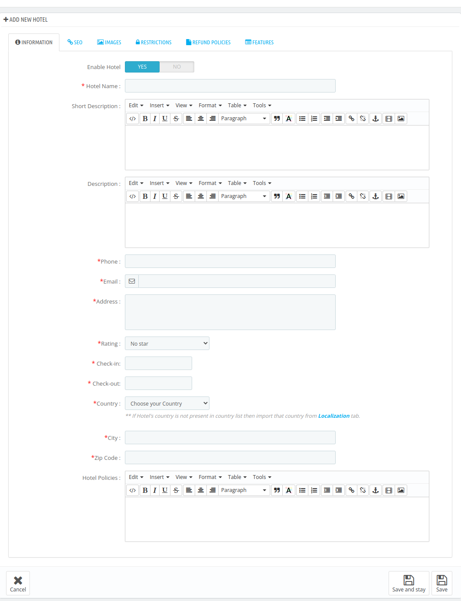
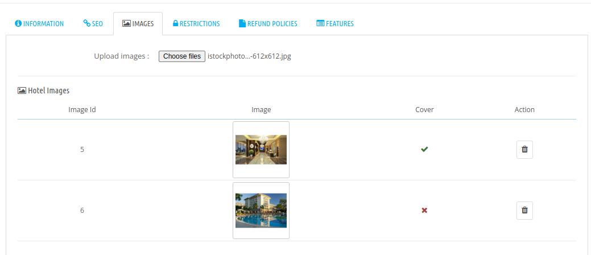
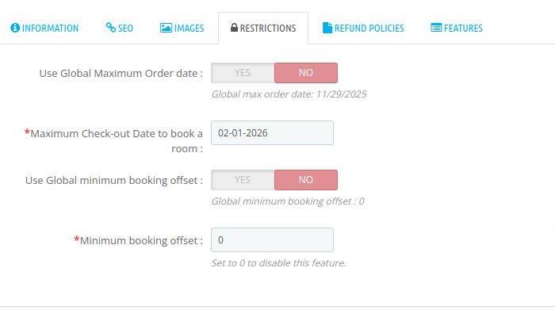
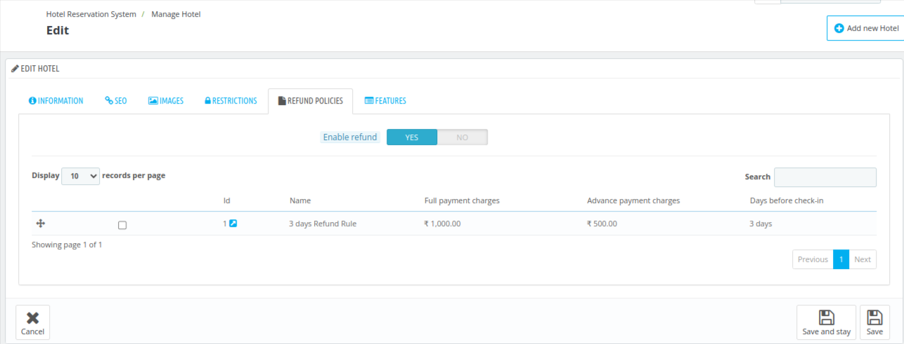
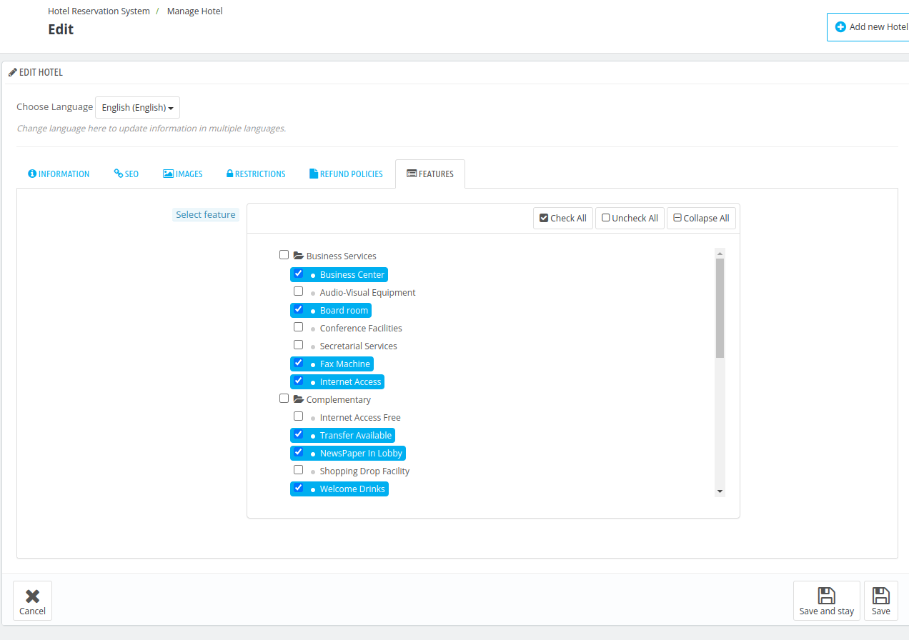
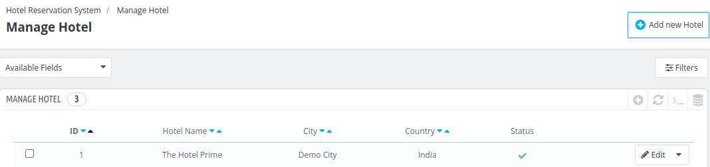
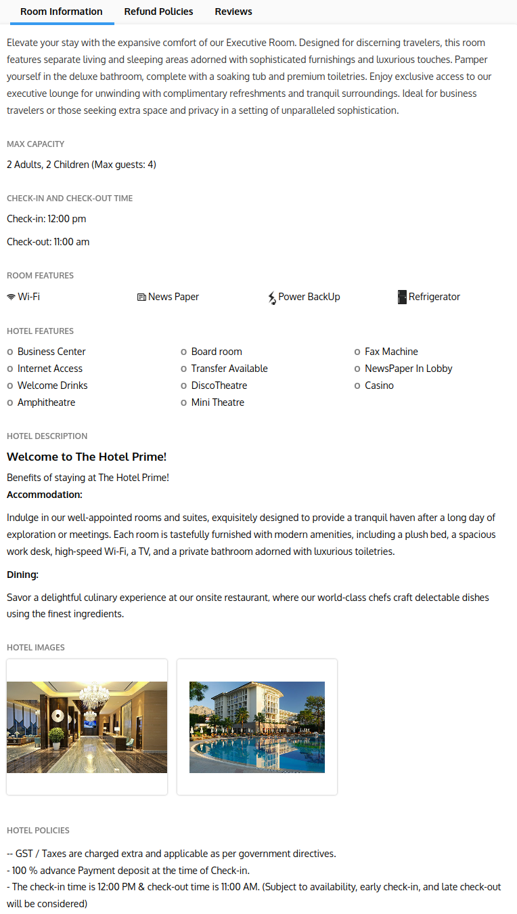

# Manage Hotel

The Manage Hotel Tab in QloApps helps you easily manage your hotel.

From Adding new hotels to managing Refund Policies, this tab ensures seamless control over your property.

## Add a new Hotel

To add a new hotel you need to click on **"Add new Hotel"** button.

After clicking "Add a New Hotel," the admin will see the following fields.

- Information
- Seo
- Images
- Restrictions
- Refund Policies
- Features

Let’s go through them one by one.

### Information

In the Information panel, the admin provides the basic details of the hotel, such as its name, address, contact information, and description. These details are essential for identifying and showcasing the hotel to potential guests.

- **Enable Hotel:** To enable/disable the hotel
- **Hotel Name:** Enter the name of the hotel.
- **Short Description:** Give a Short description of the hotel.
- **Description:** Give a detailed description of the hotel.
- **Phone:** Contact number of the hotel.
- **Email:** Enter the official Email-ID of the hotel.All booking information and related details will be sent to this email.
- **Address:** Enter the Address of the hotel.
- **Rating:** Select the star rating of your hotel from the drop-down menu.
- **Check-In:** Set the check-in time in hours and minutes.
- **Check-Out:** Set the check-out time in hours and minutes.
- **Country:** Choose your country from the drop-down menu.

    ***Note:** If your country is not available in the drop-down menu, then you need to import that country from the Localization(insert link) tab.*

- **City:** Enter your city name.
- **State:** Choose your state from the drop-down menu. You need to first choose the country before selecting the state.
- **Zip Code:** Enter the zip code of the hotel.
- **Hotel Policies:** Provide the key policies of your hotel, such as pet policies, cancellation rules, or any other important guidelines that guests need to know

Click on **save** to save the information

### SEO
Under SEO section, Fill in the details as explained below:

- **Friendly URL:** Click the "Generate" button to create a human-readable URL based on the hotel name. You can edit it manually if needed.
- **Meta Title:** Add a meta title for the hotel which will serve as the title of the public page.
- **Meta Description:** Provide a brief description of the hotel to appear in search engine results.
- **Meta Keywords:** Add relevant tags or keywords related to your hotel to improve search engine visibility.

### Images

In the **Images panel**, upload images of the hotel to showcase its features. You can select one image as the cover image, and the others will be arranged in the order you upload them

Then click on save.

### Restrictions

In the Restrictions panel, you can set the maximum date in advance for booking a room and define the minimum booking offset, which specifies the earliest time a booking can be made before the check-in date

- **Use Global Maximum Order date:** If set to **No**, you can specify your own maximum date for booking a room.
- **Use Global minimum booking offset:** Enter the number of days after which a booking can be made from current time.

To set the Global Maximum Order Date, go to **Preferences > Orders**

- **Maximum Global Date to Book a Room:** Set the maximum date after which bookings are not allowed.

- **Use Global Minimum Booking Offset:** Enter the number of days before the check-in date that a booking will be accepted.

### Refund Policies

To enable refunds, select "Yes" and choose the refund rule you wish to apply for this hotel from the options below.

These rules can be created in the [Manage Order Refund Rules](../manage_refund_rules/) section.

### Features

Under the features, the admin will assign all the relevant features that the hotel offers by selecting options from various parent categories.

These rules can be created in [Add new features](../manage_hotel_features/) section

### Edit Hotel

You can edit the hotel by tapping on the edit hotel button.

Here you have to follow the steps discussed above in the [Add Hotel](#add-a-new-hotel)   section to edit the hotel.

### Front end view

On the front end, this is how all these sections appear on the room type page.

