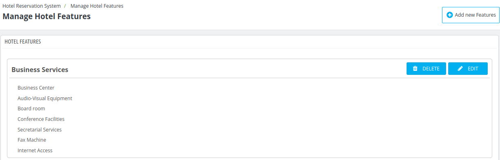
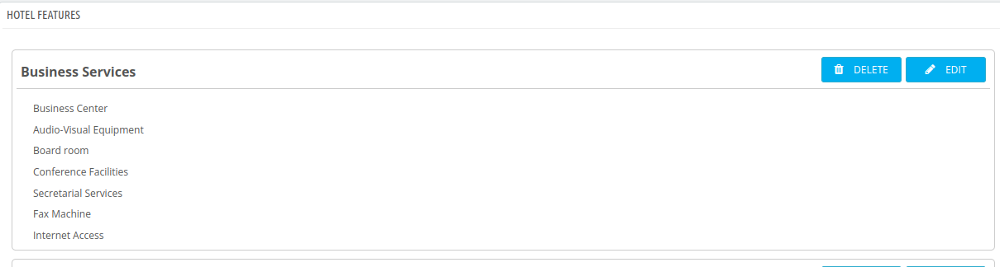

# Manage Hotel Features

Under the Manage Hotel Features tab, the admin can create new features for their hotels and assign them to the respective properties as needed.

## Add a new Feature

To add a new feature you need to click on **"Add a new feature"** button.

After clicking **Add a New Feature** the admin will be prompted to fill in the following fields:

- **Parent Feature Name:** Specify the main feature category under which this feature will be grouped.
- **Position:** Define the display order of the feature within the list.
- **Child Features:** Add sub-features or specific details related to the parent feature.

## Edit a feature

Admin can edit any existing feature by simply clicking on the Edit button. Update the fields in the same way as when adding a new feature, and save the changes

## Delete a feature

Admin can Delete any existing feature by simply clicking on the delete button

