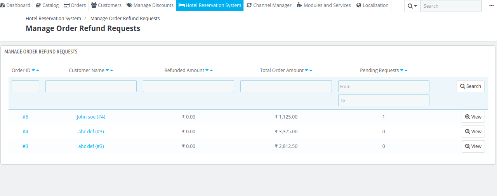

# Manage Order Refund request

 The Manage Order Refund Requests section allows the admin to review and process refund requests made by customers. Here, the admin can view the details of each refund request, including the order information, refund amount, and reason for the request.

The admin can either approve or decline the refund based on the hotel's policies and the conditions set in the refund rules.

## Initiate a refund

To approve or reject a refund request, navigate to the Manage Order Refund Request section. Click on View for the specific refund request you want to process.

After clicking on View, you will be redirected to a page displaying the following details:

### Customer details

- **Customer name:**
- **Customer email:**
- **Cancelation reason:**

### Booking Details

- **Order Id:**
- **Total order amount:**
- **Total paid amount:**
- **Way of payment:**
- **Current order state:**
- **Current refund state:**

After that, the admin will see the booking details for which the refund request has been received.

The admin can update the refund status to Denied or Completed and enter the refund amount processed for the customer. This ensures the refund is handled efficiently and recorded successfully.

