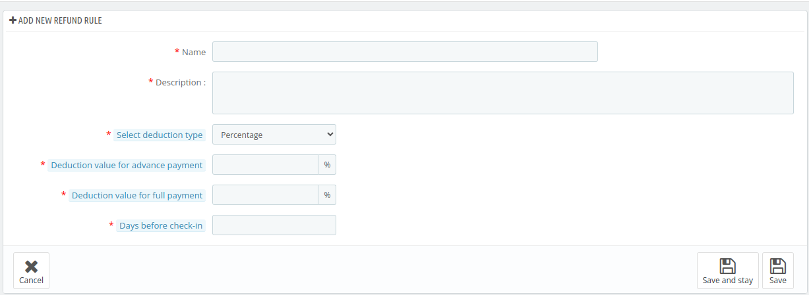
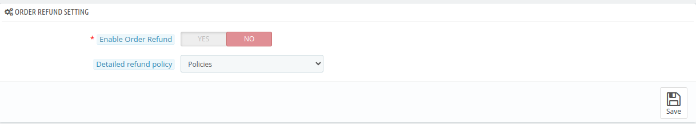

# Manage Order Refund Rule

The Manage Order Refund Rule section allows the admin to define and configure the rules for processing refunds.

Here, the admin can set conditions under which refunds are applicable, such as time frames, and cancellation policies.

This feature helps the admin streamline the refund process and ensure consistency in handling customer requests.

The admin can create multiple new refund rules or modify existing ones to suit the hotel's policies, ensuring clear guidelines for refund eligibility and amounts.

## Add a new refund rule

By clicking on the **'Add new refund rule'** button, the admin can create a new rule.

Here, the admin will need to fill in the following fields:

- **Name:** Enter the name for the refund
- **Description:** Provide a brief description of the refund rule.
- **Select the deduction type:** Choose the deduction type (Percentage or fixed amount).
- **Deduction value for advance payments:** Enter the deduction percentage for advance payments.
- **Deduction value for full payments:**  Enter the deduction percentage for full payments.
- **Days before check-in:** Specify the number of days before check-in when the refund rule applies.

## Order Refund Setting

Here, the admin can make changes to the following:
- **Enable Order Refund Rule:** Enable, if you want to enable order refund feature
- **Detailed Refund Policies:** Select CMS for a detailed refund policy for the customer.

## Manage Order Refund Rule

Here, the admin can edit the refund rule by following the same steps as discussed in the Add Refund section.

Simply click on the Edit button and modify the necessary fields, such as name, description, deduction type, and payment values.

