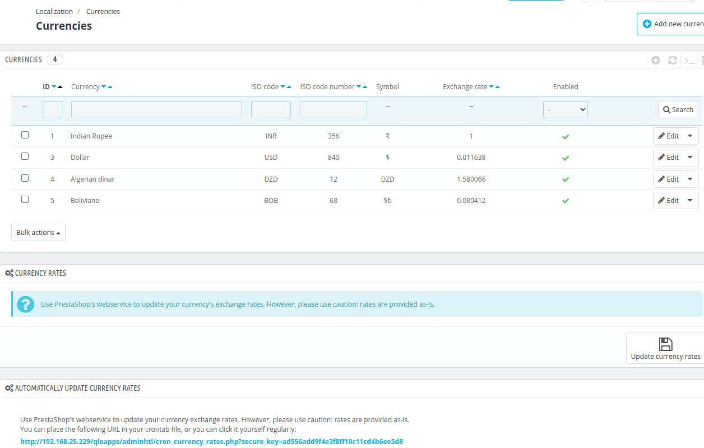
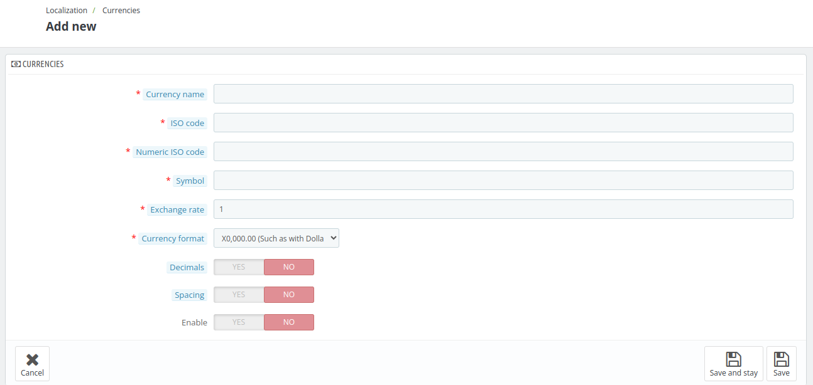
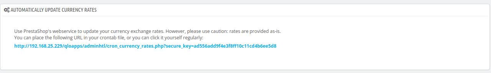

# Currencies

The **Currency Section** allows you to manage the currencies available in your system. This section ensures that your guests can view prices and make payments in their preferred currencies.

Here, the admin can add, edit, or delete the currencies.

The admin can view the **ISO code, ISO code number, symbol, exchange rate and toggle the enable/disable** status of the currency.

*Note- you can change default your currency from  [Localisation](../localization/) menu.*

## Add a new  currency

To add a new currency, first click on add new currency and fill in the following fields:

- **Currency Name**: Enter the name of the currency.

- **ISO code**: Enter the three letter currency ISO code.(e.g- USD for dollar, INR for rupee).

- **Numeric ISO code**: Enter the three digit currency ISO code.(e.g- 840 for dollar, 978 for euros).

- **Symbol**: Add the currrecy symbol you want to display with your currency.(e.g- $ for dollar.)

- **Exchange rate**: This rate is to be defined according to your hotel's default currency. For example, if the default currency is euros and your chosen currency is dollars, type "1.20" (1€ = $1.20).

- **Currency format**: Choose how the currency will be displayed (e.g., $1,000.00 for Dollars).

- **Decimals**: click on yes if you wants to display decimals in price.
- **spacing**: click on yes if you wants to space between symbol and price.
- **Enable**: click on yes if you want to enable this currency for your website.

## Edit a currency

To edit a currency, click the Edit option and provide all the details just as you did when adding it.

## Currency Rates

Through this section, the admin can update the current currency rates by clicking on **update currency rates** option.

*Note-This feature uses PrestaShop's web service to update your currency's exchange rates. Please exercise caution, as the rates are provided as-is and may require verification for accuracy.*

## Automatically Update currency rates

This option allows you to automatically update currency exchange rates using PrestaShop's web service.

You can automate this process by placing the following URL in your crontab file to schedule regular updates.

*Note: Use caution when relying on this service, as the exchange rates are provided as-is and may require verification for accuracy.*

