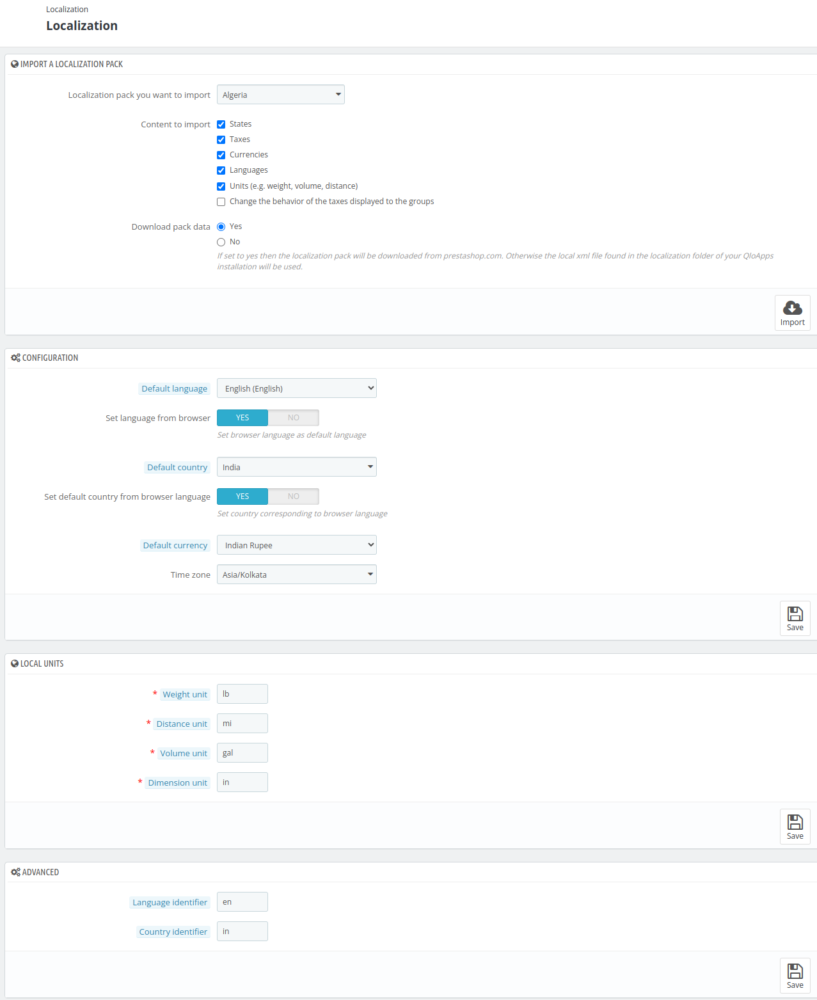
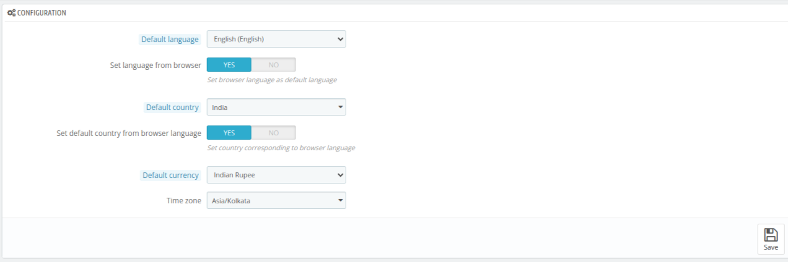
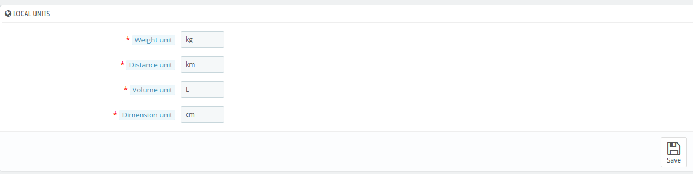
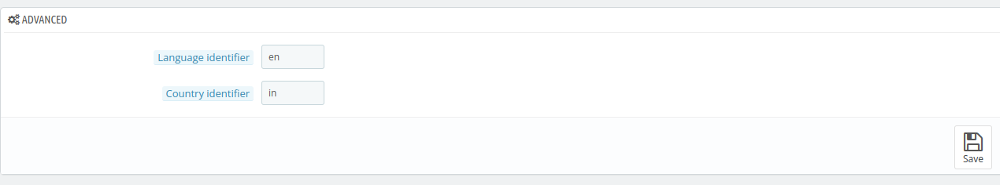

# Localization

The **localization section** allows the admin to make the hotel management system suitable for users worldwide. It enables customization of the platform in terms of languages, currencies, time zones, and regional preferences.

## Import a localization pack

Through this section, admin can import a localization pack from a list of available options.

It allows you to import various content, such as states, taxes, currencies, and more.

Admin can choose the country for which he wants to import information for his website.

The data you can import from localization packs includes:

- **States**
- **Taxes**
- **Currencies**
- **Languages**
- **Units (e.g., weight, volume, distance)**
- **Change the behavior of the taxes displayed to the groups**

## Configuration

From this section, admin can set the default settings for his website based on his hotel's location.

Using the following three options, admin can set the defeault **currency, language, country, and time zone** for your location.

- **Default Language**: The default content for your customers will be displayed in the lanaguage you will select as the default language.

-  **Set language from browser**: If you enable this option, then QloApps will set the webiste's language depending on the language of the visitor's browser's locale code (if available).

- **Default Country**: Select the country in which your hotel is located.

- **Set default country from browser language**: If you enable this option, then QloApps will set the website's country depending on the territory of the visitor's browser's locale code (if available).

- **Default Currency**: Choose the default currency in which you would like to set the prices for your hotel.

- **Time Zone**: Select the time zone in which your hotel is situated.

## Local Units

Using this section, the admin can configure the local units for various measurements, such as:

- Weight
- Distance
- Volume
- Dimension

## Advanced

Here, the admin can set the local language and the country code where the server is located, ensuring that the system operates in the desired language and follows the regional conventions.

- **Language Identifier**: Enter the ISO 639-1 language code, which is a two-letter code representing the language you wish to set for your system.

- **Country Identifier**: Enter the ISO 3166-1 country code, which is a two-letter code representing the country where your hotel operates.

 
