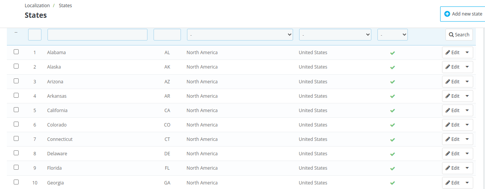

# States

The **States Section** allows you to manage states or regions within a country. This section helps you define and organize states for better management of locations and tax rules.

Admin can add, edit, or delete states as needed and  can view the **ISO code, zone, country, and toggle the enable/disable status** of the state.

## Add a new state

To add a new state, Click on "Add New State" and fill in the following fields.

- **Name**: provide the state name to be display in addresses and on invoices.

- **ISO code**: provide the 1 to 4 letter ISO code.you can prefix it with the country ISO code if needed.

- **Country**: Select the country of the state using the drop-down menu.

  *Note- Only the countries with the option "contains states" enabled will be displayed here.*

- **Zone**:Select the geographical zone using the drop down list.

- **Status**: Enable the state so that it can be suggested as an option in the states category.

## Edit a state

To edit a state, click the Edit option and provide all the details just as you did when adding it.

