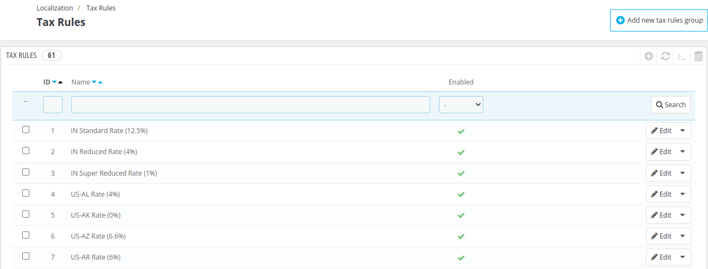
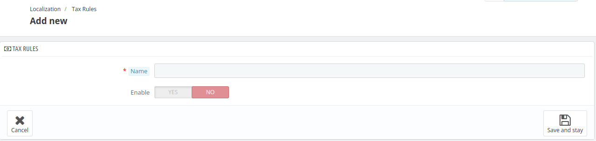

# Tax Rules

From the **Tax Rules** Section of QloApps, the admin can create and manage tax rules to define how taxes are applied based on various criteria such as country, state, or region.

Tax rules can combine multiple tax rates, ensuring accurate tax calculations for guests from different locations.

This list highlights the ID, Name, Rate, Enabled and actions option of the various existing tax rules. You can activate or deactivate any tax rules directly from the tax rules list, or you can edit or delete a tax rule using the action button at the extreme right under actions option.

## Add New Tax Rule

To add a new tax rule, click on add new tax rules group and fill in the following details.

### Tax rules

- **Name**: Add the name of the tax rule.

- **Enable**: click on yes to enable this tax.

Now, click on save and stay.

### Add new Tax rule

After this, another set of options will appear on the page with the following options. Using these you will assign taxes to this tax rule.

- **Country**: Select the country for which you are creating this rule.

    - **State**: Once you select the country, if the country contains states then option of states will appear on the screen. It will display the list of all states in that country.

- **Zip/postal code range**: This option will enable you to specify the postal codes (Zip Codes) on which you want to apply the tax rules. You can either enter a single zip code or define a range using the dash.

- **Behavior**: Some local regulations require more than one tax rule is applicable. In that case, you can choose that which among the following three ways, the tax rule should be applied:

    - **This Tax Only**: Upon selection of this tax behaviour, only this tax among all the eligible taxes will be applied on the booking.

    - **Combine**: Upon selection of this tax behaviour, all the applicable taxes will be combined. For instance: 100€ + (10% + 5% = 15%)

    - **One After Another**: Upon selection of this tax behaviour, all applicable taxes will be applied one after another.

- **Tax**: Select the tax to be used for this tax rule.

  *Note: you can also create a new tax from [Taxes](../taxes/) menu.*

- **Description**: Add a description about the tax rule.

After clicking Save & Stay, the country is added to the table below. You can then start adding another country to this tax rule group by clicking "Add a new tax rule".

*Note: The default rate applied to your Room Type and Services will be based on your hotel's default country.*

