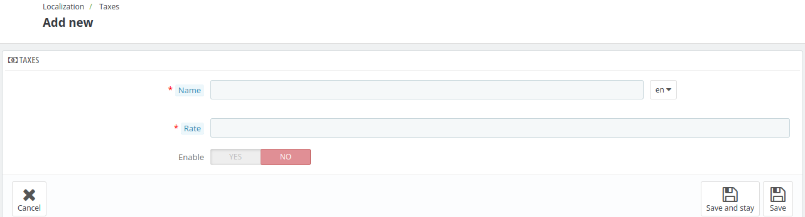
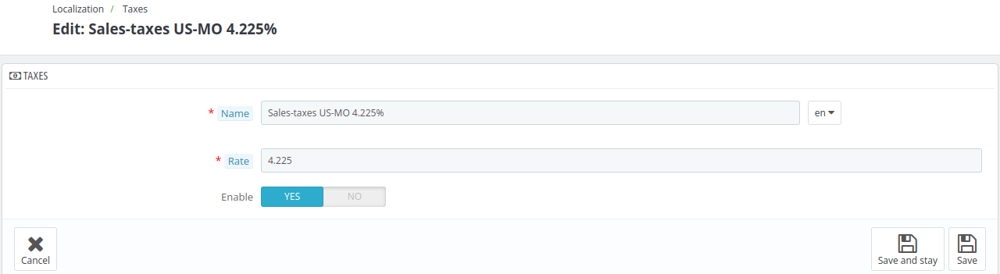

# Taxes

In the **Taxes** Section of, admin can manage and configure tax settings to comply with local regulations.

This includes adding, editing, or enabling/disabling specific taxes.

The admin can also view the **Name, rate of the tax  and toggle the enable/disable** status.

## Add New Tax

To add a new tax, click on "add new tax" and fill in the following details.

- **Name**: Add the name of the tax.This name will be displayed in the cart and on invoices.

- **Rate**: Enter the exact rate in the format (xx.xx, xx.xxx). (e.g-19.60, 19.625).

- **Enable**: You can enable or disable the tax at any time using this option.

## Edit a tax

To edit a tax, click the Edit option and provide all the details just as you did when adding it.

## Tax options

At the bottom of the page is the **Tax options** section.

With this section, the admin can configure the general settings of tax using the following options:

<!--  -->

- **Enable tax**: Enable this option if you want to include taxes in each booking made by the guests.

- **Display tax in the booking cart**:Enable this option if you want to display the tax on a distinct line in the cart.

- **Use ecotax**: enable this option if you want to apply an environmental tax to your products or services.
Enabling this feature ensures compliance with eco-tax regulations, where applicable, by automatically adding the specified tax to the total amount.

