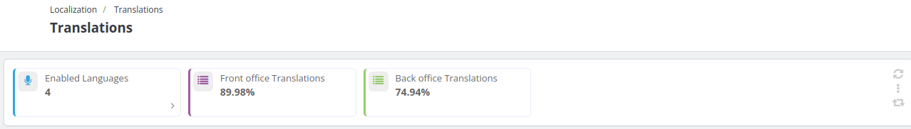
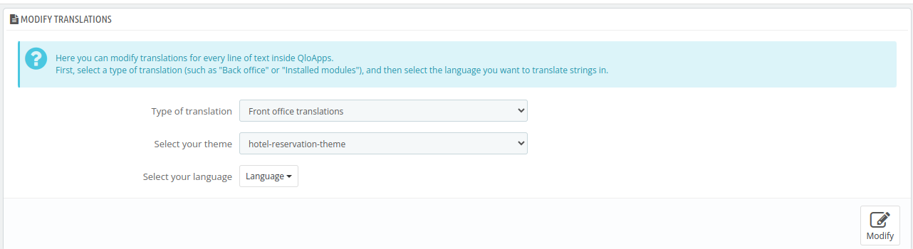
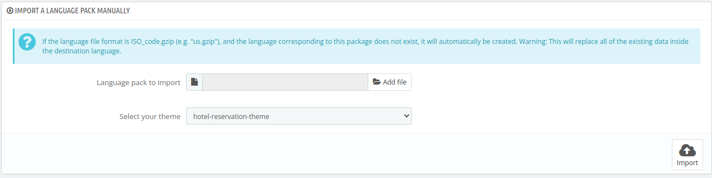
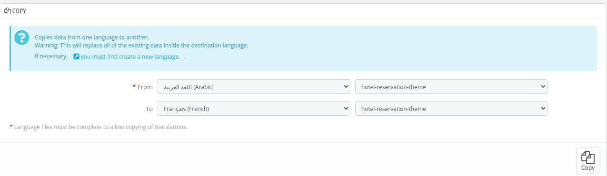

# Translations

Through this page, you can manage the language of the text displayed to guests as well as the text in the back office.

This feature helps you provide a more convenient, personalized, and customizable experience for users. You can modify the wording and tailor the text to suit your needs and better align with your guest's preferences.

## KPI metrics

This section displays 3 key performance indicators (KPIs) to help you monitor and manage translations effectively:

- **Enabled Languages:** Shows the total number of active languages available on your website.
- **Front Office Translations:** Indicates the percentage of translated text visible to guests in the front office.
- **Back Office Translations:** Tracks the percentage of translated text in the admin panel.

## Modify Translations

Here you can modify translations for every line of text inside QloApps.

To modify the translations, you have to first fill the following sections:

- **Type of translations**: select the type from the dropdown menu.Translations are divided into 7 sections.

    - **Front Office Translations**: The strings that are visible to you and your website visitors on your website.
    - **Back office translations**: The strings that are visible to you and your team from your website's back office panel.
    - **Error Message Translations**: The strings that display error messages to admin.
    - **Field Name Translations**: The strings that are visible as field names of various field options in QloApps.
    - **Installed module translations**: The strings present in a module. Only installed modules will be listed.
    - **PDF Translations**: The strings are visible in pdf documents of QloApps.
    - **Email translations**: The strings used in the default email templates.

- **Select your theme**: Select the default theme of Hotel-reservation-system under this option.

- **Select your language**: Select the language in which you want the translation to be done.

After adding details in all the above three sections, click on modify.

**Once you will click on modify, a new page will appear where you can select the category of translations that you want to modify.**

## Add/ Update a Language

To add or update a language, select the language you want from the list and click on the "Add or update a language" button.

## Import a language pack manually

TO add a new languauge, you can use this option of "import a language pack manually".

To import a new language pack, add the ZIP file of the language and click on "import". The language will be added sucessfully.

## Export a language

To export a language pack, select the language in which you want to export translations.

Next, click on Export and then your language pack will be exported sucessfully.

## Copy

You can copy the content of one language to another. This is especially useful when you want to replace a theme's language with the same language from another theme.

Select the source language and theme, then the destination language and theme, click on the "Copy" button.
