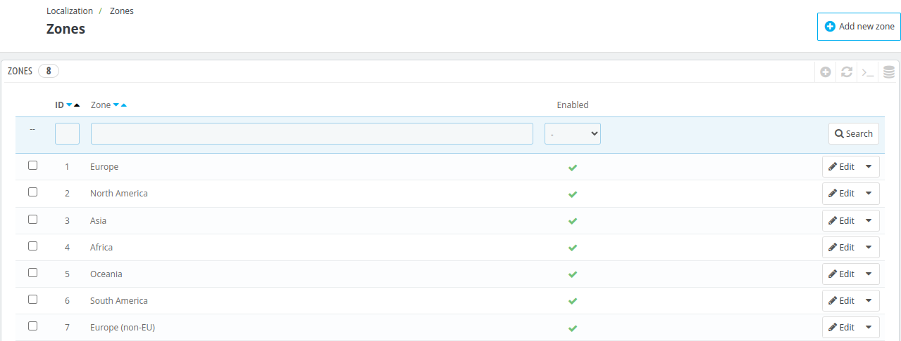

# Zones

**Zones section** helps in categorizing the countries into subregions.

This page shows a list of all standard and listed zones.

You can easily enable or disable any zone present in the list by clicking on the icon in the **Enabled** column.

## Add a new zone

To add a new zone, first click on "add new zone" present on the right corner of the page.

Now, fill in the following details

- **Name**: Add the name of the zone which you want to add.
- **Active**: Click yes to activate the status of the zone.

 

 ## Edit a Zone

To edit a zone, click the Edit option and provide all the details just as you did when adding it.