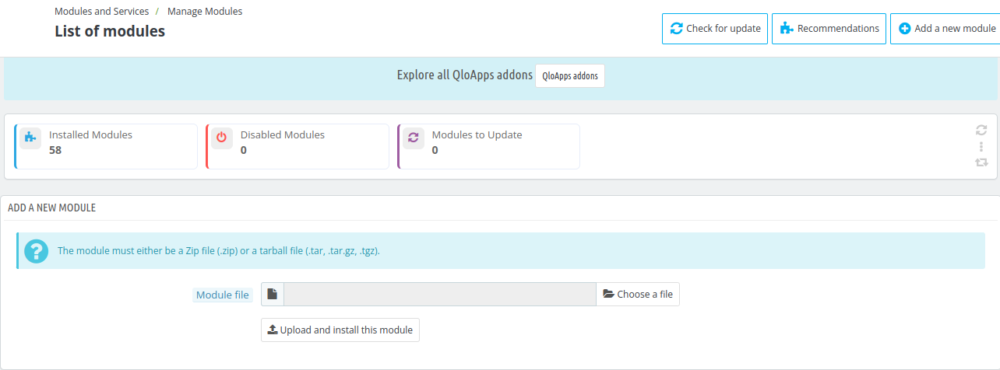
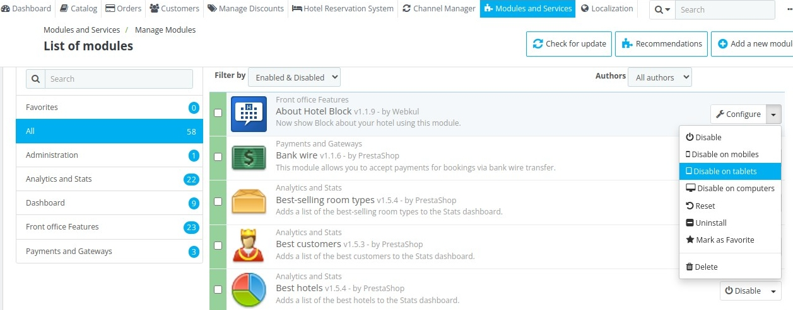

# Manage Modules

The **Manage Modules** section in QloApps provides a simple and efficient way to oversee all installed, disabled and to update-ready modules. It allows the admin to:

- Install, uninstall, enable, or disable modules.
- Configure module settings to match your needs.
- Update modules for improved performance and security  alerts to notify if there's any issue.
- Quickly search and filter modules by enabled or disabled modules and by authors.

## Add a new module

To add a new module click on **add new module** then the admin has to choose the zip file of the module and click on **upload and install this module.**

## Module List

The **Modules List** section in QloApps provides a comprehensive overview of all available modules that can be installed or managed within the platform.

Modules are organized into categories such as:
- favorites
- All
- Administration
- dashboard
- Front office features
- payment gateways

Admin can also Quickly search and filter modules by name, status or the author of the module.(eg:prestashop and webkul) to easily locate specific modules.

Admin can Easily enable, disable, configure, or update each module with a simple click.

When the admin clicks on the drop-down button next Configuration, he will see the following options:

- Disable
- Disable on mobiles
- Disable on tablets
- Disable on computers
- Reset
- Uninstall
- Mark as favorite
- Delete

