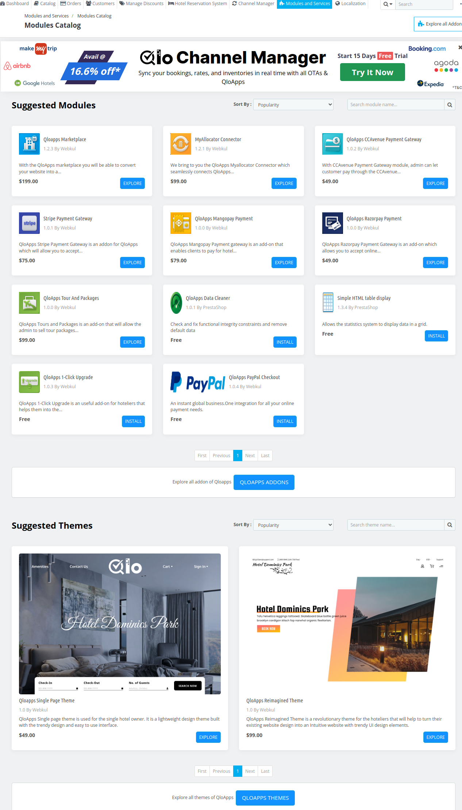
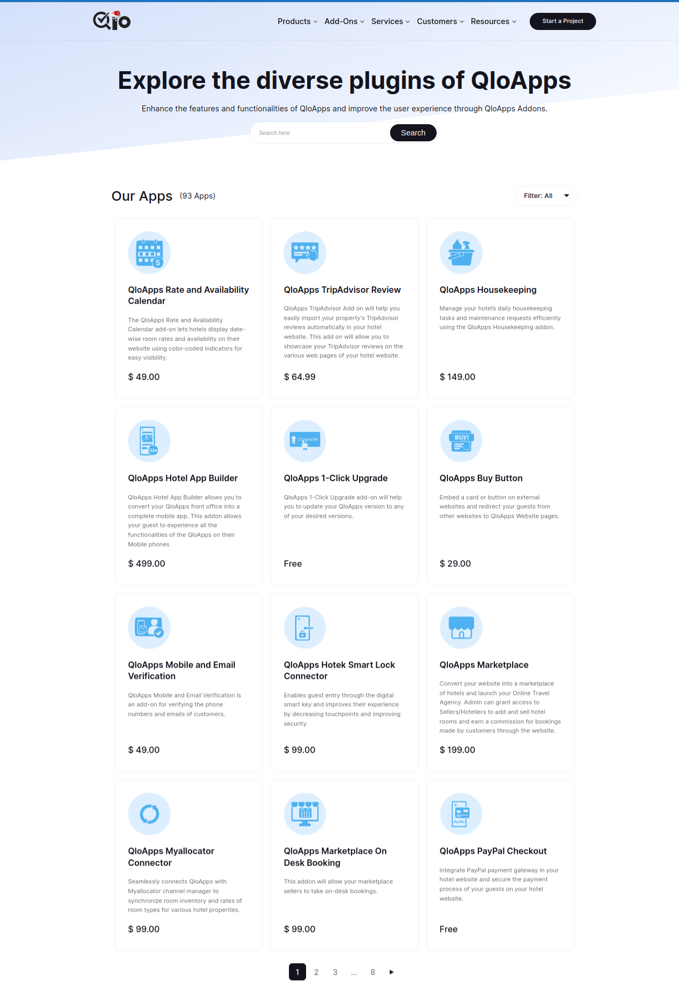
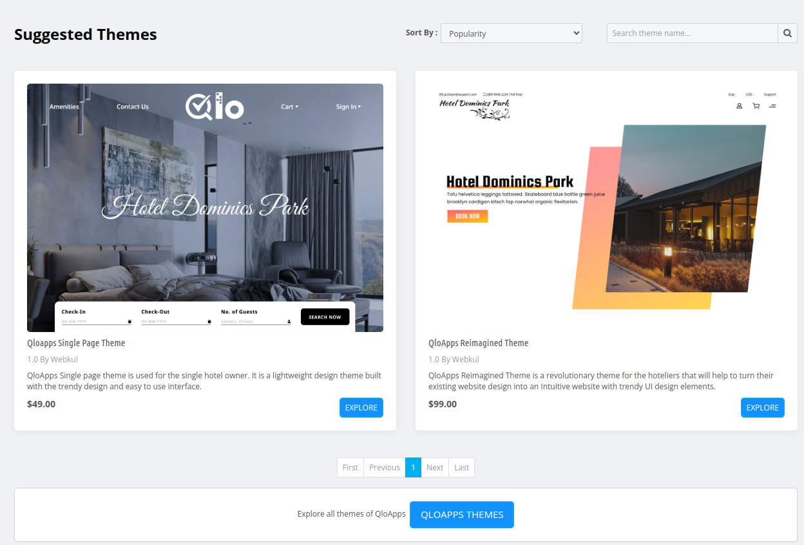

# Modules catalog

The **Modules Catalog** section in QloApps is a comprehensive marketplace that displays all available modules, add-ons, and themes that can be installed to extend the functionality and enhance the appearance of the hotel management system.

## Explore all addons

When the admin click on **Explore all addons** he'll be redirected to a page where he can Browse through a wide variety of modules tailored to improve operational efficiency.

## Suggested modules

The **Suggested Modules** section in QloApps highlights recommended add-ons designed to enhance your platform's functionality.

This section allows you to easily browse, search, and filter modules by name, popularity, or price (low to high or high to low).

With just a few clicks, you can discover and install the most suitable modules.

## Suggested Themes

The Suggested Themes section in QloApps showcases a curated selection of themes designed to enhance the visual appeal and user experience of your hotel booking platform.

Admin can easily browse, search, and filter Themes by name, popularity, or price (low to high or high to low).

## Explore all QloApps themes

when the admin clicks on **Explore all QloApp themes** then he'll be redirected to a page that shows a  comprehensive collection of all available themes designed to enhance the appearance of the hotel management system.

