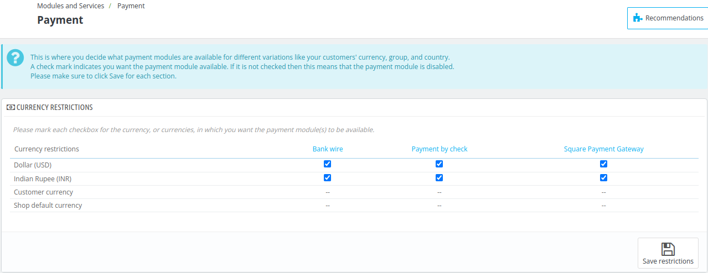
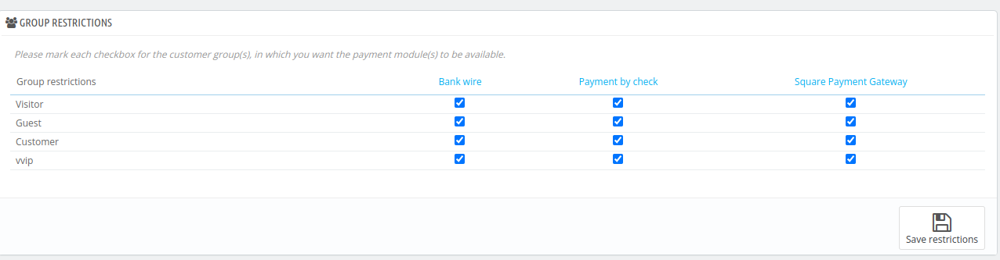

# Payments

The **Payments section** in QloApps is a place where the admin decides what payment modules are available for different variations like **currency and Group.**

A check mark indicates you want the payment module available. If it is not checked then this means that the payment module is disabled.

## Currency Restriction

With this section admin can decide which modes of payment are available for customers based on their currencies.

the admin simply needs to mark the checkbox for each currency (or currencies) in which they want the payment module(s) to be available.

## Group Restriction

With this section admin can decide which modes of payment are available for customers based on the Groups they belong to.

the admin simply needs to mark the checkbox for each group (or groups) in which they want the payment module(s) to be available.

