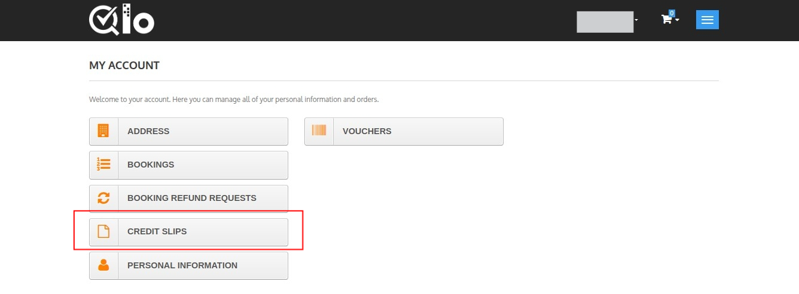
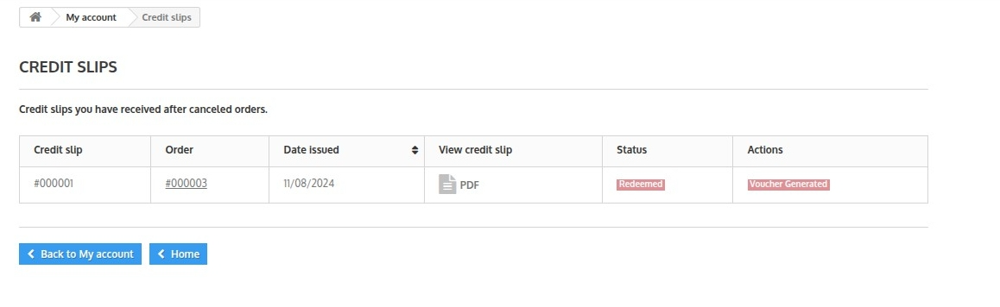
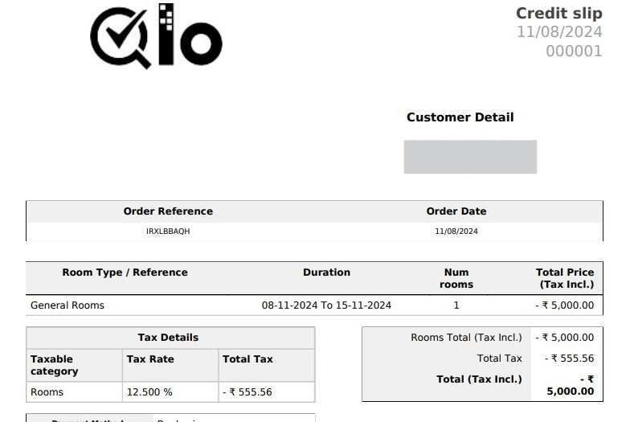

# Credit Slips

Credit slips are the slips generated for the credits provided to the guests  when they cancel their orders.

This page contains following sections:

## Credit Slips

This section displays the list of all credit slips which you have issued for your hotel.

The following details about the credit are displayed in the credit slip.

- ID
- Order ID
- Date Issued
- PDF
- Status
- Voucher

## Print a PDF

You can also filter and generate the report of all credit slips issued by your hotel to the guests for a particular duration of time through this section.

Select the date ranges from the calendar and click on "generate PDF File".

## Credit slip options

**Credit slip Prefix**

To insert prefix in the credit slip number, Add the prefix in the box.

## Customer account Credit Slip
Customer can see all his credit slip by going to his account page then click on the Credit Slips button.

After clicking he can see all the credit slips available to him.

## Sample Credit Slip
