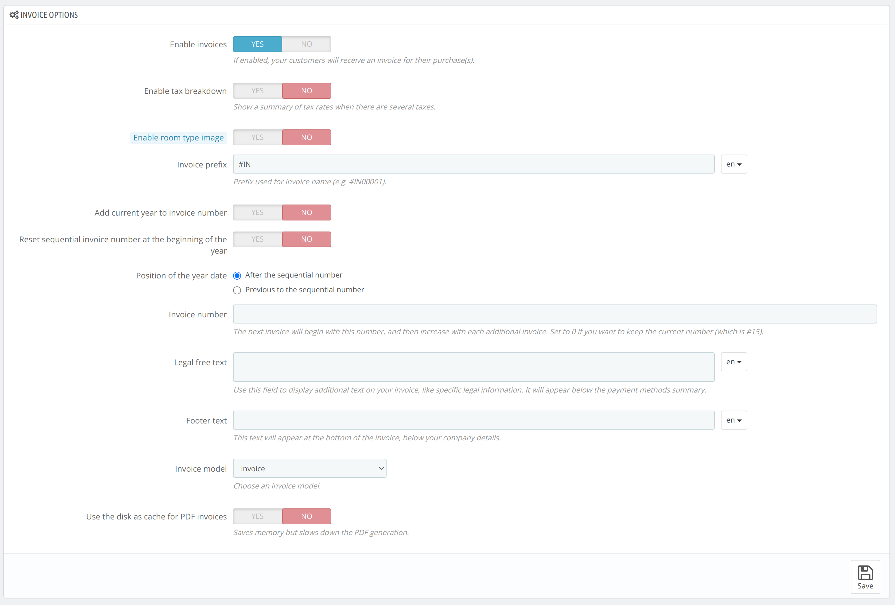
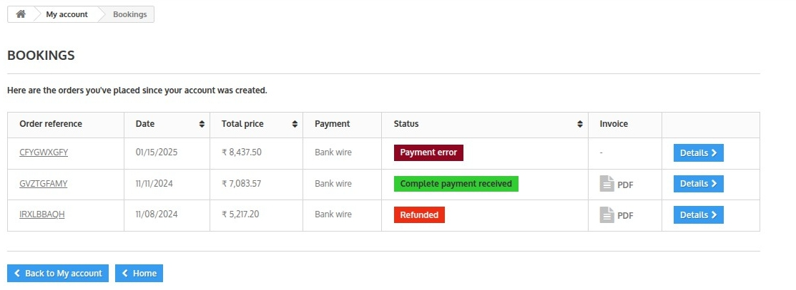

# Invoices

Invoices tab is used to generate and configure the invoices of your orders.

## By Date

This section is used to generate the combined report of Invoices for a particular duration of time.

You can select the date range for which you want to obtain the invoice and then click on **generate PDF by date** to generate the PDF.

## Order status

You can also generate a combined report of Invoices as per the various order status.

You can filter and generate the invoice of the order as per following order status:

- Awaiting payment
- Awaiting remote payment
- Canceled
- Overbooking (not paid)
- Overbooking (paid)
- Partial payment accepted
- Payment accepted
- Payment error
- Processing in progress
- Refunded
- Remote payment accepted

## Invoice Options

You can configure the invoice using the various options in the Invoice options section.

#### Enable Invoice

Enable the invoice option by selecting yes to send the invoice of your guest's orders to your guest, else select no to disable.

##### Enable Tax Breakdown

Enable this option to show a summary of tax rates when there are several taxes.

#### Enable Room Type Images

Enable this option to add room type images before the product name in the invoice.

#### Invoice Prefix

To insert prefix in the invoice, Add the prefix in the box.

#### Add current year to invoice number

Enable this option to add current year with the invoice number.

#### Reset sequential invoice number at the beginning of the year

Enable this option to reset the sequential invoice number at the beginning of the year

#### Position of the year date

You can set the position where the year date will be added with the sequential invoice number. There are 2 position options:

- After the sequential number.
- Previous to the sequential number.

#### Invoice Number

Add the number with which you want to start the invoices number. The next invoice will begin with the number you will add in this section number, and then increase with each additional invoice.

***NOTE: Set to 0 if you want to keep the current number***

#### Legal Free Text

Use this field to display additional text on your invoice, like specific legal information. It will appear below the payment methods summary.

#### Footer Text

Add the text you want to show at the bottom of the invoice. This text will appear at the bottom of the invoice, below your company details.

#### Invoice model

Choose one among the following 2 model of the invoice as per your business.

- Invoice: To generate invoice for guest orders.
- Invoice B2B: To generate invoice for B2B orders.

#### Use the disk as cache for PDF invoices

Enable this option to save memory of your invoices. Although, it slows down the PDF generation

**Customer can download his invoice from the bookings page.**

#### Sample Invoice
