# Orders

This tab displays the list of orders you received for your hotels.

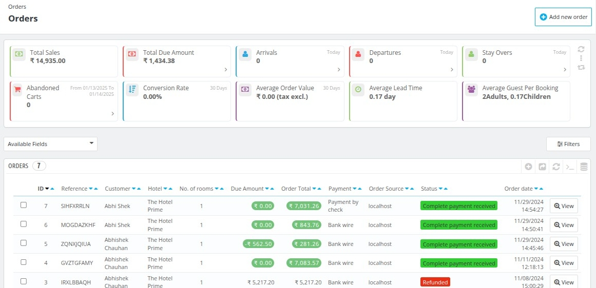

## KPIs

- **Total Sales** : This field tell you about all the  sales and revenue created by all orders combined.
- **Total Due Amount** : This field tell you about all the due amount left for all the orders.
- **Arrivals** : Total number of arrivals for today.
- **Departures** : Total number of departures for today.
- **Stays Over** : Total number of stays over for today.
- **Abandoned Carts** : Total number of Abandoned carts for today.
- **Conversion Rates** : Percentage of visit that results into order booking in given period of time.
- **Average order value** : Total average order value excluding tax in a period time.
- **Average Lead time** : Average number of days between time guest book their room and time guest arrive at the hotel.
- **Average guest per booking** : It tell you about the average number of guest per booking.

## Filters

### Available Fields

You can display the various fields of the order by selecting them from available fields options.

### Filters

The order data can be filtered using the various search filters.

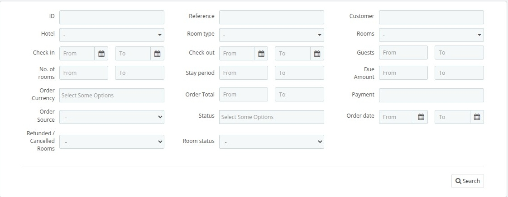
In this filter you can filter list based on:
- **ID** : ID of the room type.
- **Hotel** : You can filters based on the hotels.
- **Check-in** : You can filter orders based on the check-in date of the customers.
- **Number of Rooms** : You can filter orders based on the number of rooms.
- **Order currency** : You can filter based on the Order currency.
- **Order Source** : You can filter based on the Order Source.
- **Refunded/cancelled rooms** : You can filter based on the Refunded/cancelled rooms status.
- **Reference** : You can filter based on the reference.
- **Room type** : You can filter orders based on the room types.
- **Check-out** : You can filter orders based on the check-out date of the customers.
- **Stay-period** : You can filter orders based on the stay period of the customers.
- **Order total** : You can filter orders based on the total amount of the orders.
- **Status** : You can filter list based on the status of the order.
-  **Room Status** : You can filter list based on the status of the room type.
- **Customer** : You can filter based on the name of the customer.
-  **Rooms** : You can filter the list based on the name on the room number.
- **Guest** : You can select the number of the guest range.
- **Due Amount** : You can filter result based on the due amount.
- **Payment** : You can filter results based on the Payment amount.
- **Order Date** : You can filter based on the Order date.

## View order details

To view the order details of any order click on view option.

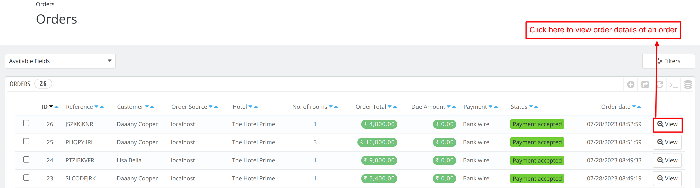

## Details of booking of particular order

At first we have some important Shortcut buttons to Quickly complete some tasks.

- **View Hotel** : Opens the settings page for the hotel associated with this order.
- **View Invoice** : Allows you to view the invoice for the selected order.
- **Print order** : Provides an option to print the details of this order.
- **Initiate Refund** : Enables you to initiate a refund for this order effortlessly.

The various section on the order details page display and edit various details of the order. Lets discuss each section of the page one by one.

#### Room Status

You can update the room status of the room through following options:

- **Order status**: To update the status of room (check-in, check-out, alloted) click on the edit button.

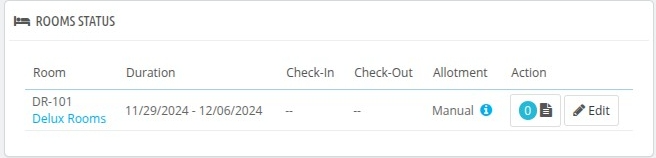

### Order

This section displays the data of the order.

You can update the payments status of the order by selecting the status from the drop down and then clicking update status button.

You can add view the documents uploaded for this order and can also add a note for the document.

#### Customer

It displays the following details of the guest:

- Email: Email of guest
- Phone: Phone of guest
- Account registered: Date of guest .registration of client on website.
- Private note: Add notes about guest to personalize his experience.

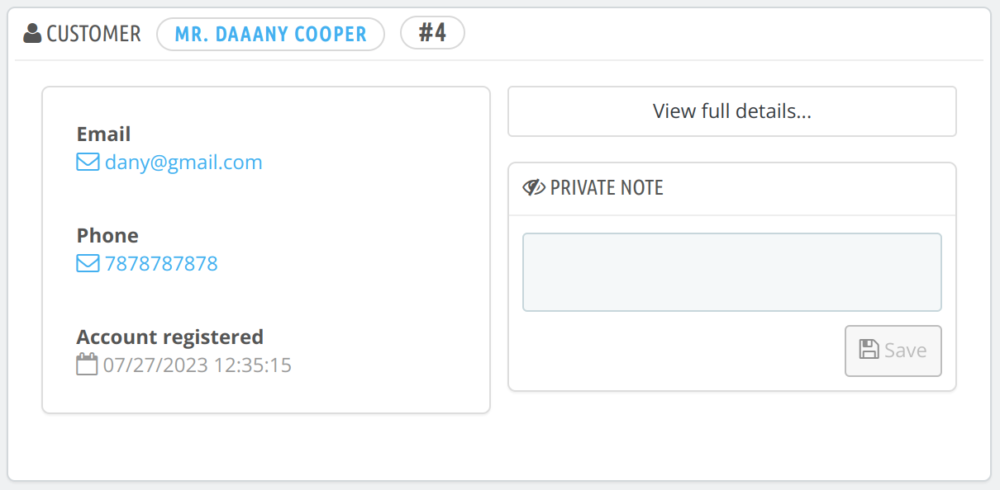

**To view the full details of the customer click on view full details and you will be redirected to customers page**

#### Guest Booking
If the customer have booked a room for someone else you will see a different section which shows the details of the Travelers.

#### Payments

This section displays the details of the payment of the order.

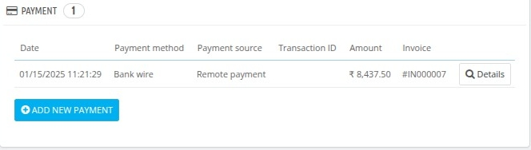

To Add new payment in case partial payment is made or when guests pays on desk click on.**Add new payment**.

Fill the details and save the data.

#### Cancellation Policy

This section dsiplays the cancellation policy of the hotel.

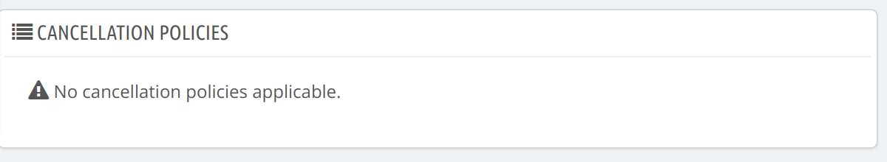

#### Room booking Detail

THis section displays the  following details of the order:

- Room Number
- Room Image
- Room type
- Hotel Name
- Duration
- Occupancy
- Room Price
- Extra services
- Tax
- Total price

**Edit order details**

Click on edit to edit the details of the order. You can edit the following details of order:

- Check-in
- Check-out
- Price
- Occupancy

**Reallocation and Swap of order**

 You can also reallocate and delete the order of the guest.
 To reallocate click on the drop down right to the dit button and then click on the reallocate and Swap.

 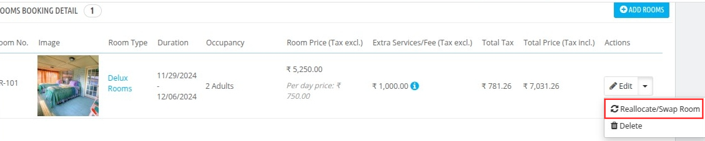

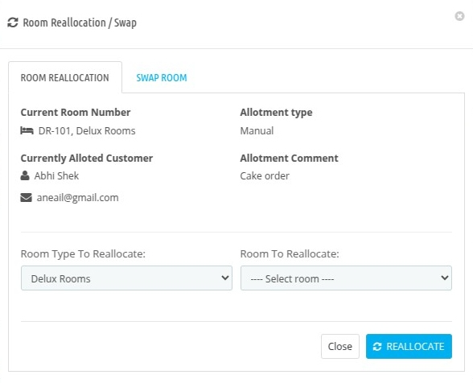

**Add rooms in order**

To add a new room of any room type in the order click on add rooms in order and fill up the details.

#### Messages

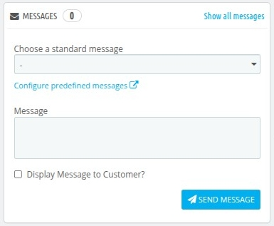

To communicate between the guest through messages using this section.

Fill the following details and click send:

- Choose a standard message: select default message or add a predefined messages.
- Display to customer: Choose yes or no to decide whether you want to display customers or not.
- Message: Add the content of the message.

#### Vouchers

Here you can see all the vouchers applied to the customer.

#### Order Summary

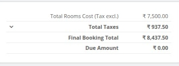

In this section you can see the order summary like:
- Total Rooms Cost
- Total Taxes
- Final booking total
- Due Amount

