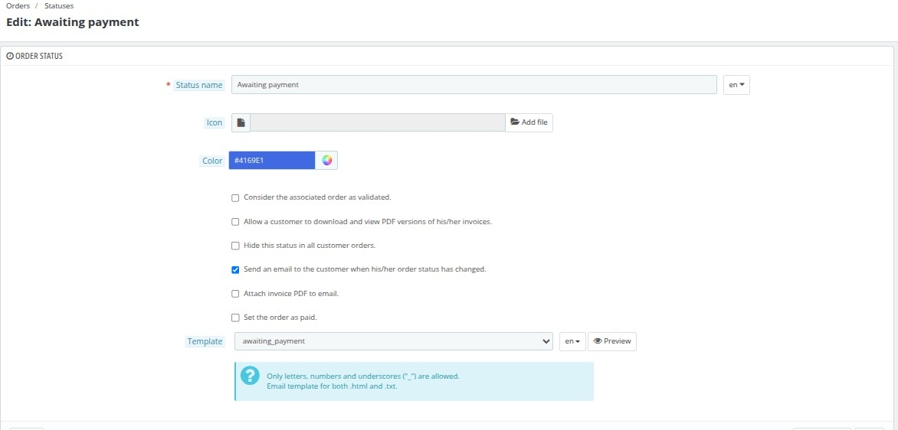
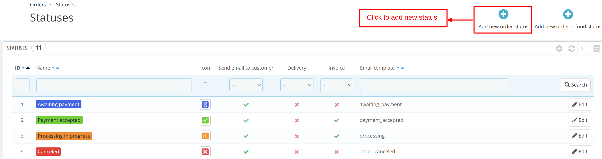
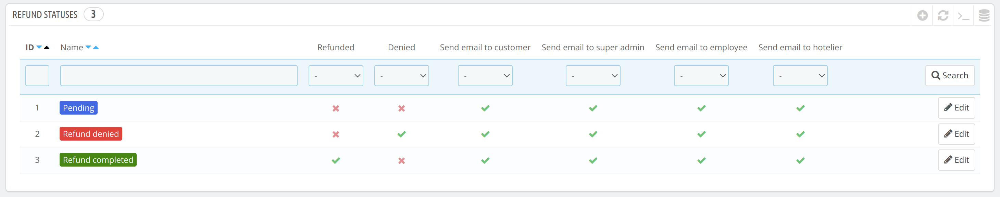
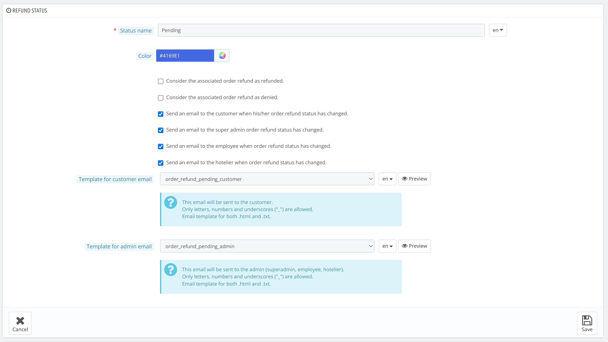
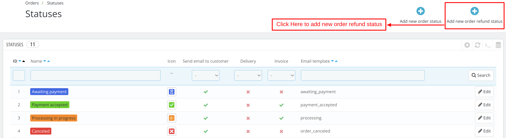

# Statuses

In this tab all the payment and refund status are visible in this category.

You can also create a new payment and refund status in this tab.

## Statuses section

List of all created and available status of payment are displayed in this section.

It displays the following data of the payment status:

- Name
- Icon
- Send Email To customer
- Delivery
- Invoice
- Email Template

*To configure the status, click on edit button of that status.*

### Configure status

There are various options using which you can configure the statuses.

You need to fill following details to configure the status:

- **Status Name**: Add name of the status

- **Icon**: upload image of the icon

- **color**: choose the color of the status

- **Check Boxes**: check the box as per the feature you want to enable with this status:
    - Consider the associated order as validated.
    - Allow a customer to download and view PDF versions of his/her invoices.
    - Hide this status in all customer orders.
    - Send an email to the customer when his/her order status has changed.
    - Attach invoice PDF to email.
    - Attach delivery slip PDF to email.
    - Set the order as shipped.
    - Set the order as paid.
    - Show delivery PDF.

- **Template**

Select the template of the mail which will be sent to your customers when this status will be applicable.
You can also preview the mail template by clicking on the preview button.

### Add new status

To add a new status, click on add a new order status option.

Next, add the following details and save:

- **Status Name**: Add name of the status
- **Icon**: upload image of the icon
- **color**: choose the color of the status
- **Check Boxes**: check the box as per the feature you want to enable with this status:
    - Consider the associated order as validated.
    - Allow a customer to download and view PDF versions of his/her invoices.
    - Hide this status in all customer orders.
    - Send an email to the customer when his/her order status has changed.
    - Attach invoice PDF to email.
    - Attach delivery slip PDF to email.
    - Set the order as shipped.
    - Set the order as paid.
    - Show delivery PDF.

## Refund statuses section

List of all created and available status of refund are displayed here.

The list displays the following data of refund:
- ID
- Name
- Refunded
- Denied
- Send email to customer
- Send email to super admin
- Send email to employee
- Send email to hotelier

*To configure the refund status, click on edit button of that refund status.*

### Configure Refund Status

There are various options using which you can configure the refund status.

You need to fill following details to configure the refund status:

- **Status Name**: Add name of the status
- **color**: choose the color of the status
- **Check Boxes**: check the box as per the feature you want to enable with this status:
  - Consider the associated order refund as refunded.
  - Consider the associated order refund as denied.
  - Send an email to the customer when his/her order refund status has changed.
  - Send an email to the super admin order refund status has changed.
  - Send an email to the employee when order refund status has changed.
  - Send an email to the hotelier when order refund status has changed.

- **Template For customer Email**

Select the template of the mail which will be sent to your customers when this refund status will be applicable.
You can also preview the mail template by clicking on the preview button.

- **Template For Admin Email**

Select the template of the mail which will be sent to the admin when this refund status will be applicable.
You can also preview the mail template by clicking on the preview button.

### Add new Refund status

To add a new refund status, click on add a new refund status option.

Next, add the following details and save:

- **Status Name**: Add name of the status
- **color**: choose the color of the status
- **Check Boxes**: check the box as per the feature you want to enable with this status:

    - Consider the associated order refund as refunded.
    - Consider the associated order refund as denied.
    - Send an email to the customer when his/her order refund status has changed.
    - Send an email to the super admin order refund status has changed.
    - Send an email to the employee when order refund status has changed.
    - Send an email to the hotelier when order refund status has changed.

